<!-- Design decisions + architecture deep-dive · #29 -->

# Design

## What this is

This system tokenizes a first-lien mortgage loan as a permissioned security token on Avalanche, models the loan's ongoing cash flows as on-chain accruals, and runs a continuous off-chain reconciliation engine that proves the token remains fully backed before any distribution is permitted. Investors hold pro-rata claims denominated in the token ([`CreditToken.sol`](../../contracts/src/CreditToken.sol)); an identity and compliance layer ([`IdentityRegistry.sol`](../../contracts/src/IdentityRegistry.sol), [`ComplianceRegistry.sol`](../../contracts/src/ComplianceRegistry.sol)) enforces transfer restrictions so the token behaves as a regulated security rather than a freely tradable asset; and the reconciliation engine ([`api/src/recon/engine.ts`](../../api/src/recon/engine.ts)) acts as a circuit-breaker that halts distributions the moment the off-chain reserve falls out of step with on-chain obligations.

> **The core idea: Reconciliation is a gate, not a report.**
>
> Most tokenized-RWA systems treat reconciliation as a periodic audit artifact — something produced for regulators after the fact. This system treats it as a precondition. No distribution clears without a passing reconciliation proof. The gate cannot be bypassed; it is architectural, not procedural.

### Why this problem is hard — the two-ledger problem

A mortgage loan exists in two worlds simultaneously, and they do not tick at the same rate.

On-chain, accrual runs on a deterministic schedule. Interest accrues linearly — balance × `ratePerSecond` × elapsed seconds, no compounding, no amortization curve modeled — and the smart contract's view of what investors are owed is always current and always precise. This is the ledger you control.

Off-chain, cash arrives on its own messy timetable. A borrower makes a payment late, or early, or in two tranches through a servicer that batches wire transfers on business days. A NAV mark changes because an independent appraiser updated a comparable sale. A reserve account at a custodian earns overnight interest that wasn't modeled in the original amortization schedule. None of these events touch the chain until a human or an automated pipeline explicitly writes them there — and that pipeline has latency, failures, and reconciliation gaps of its own.

The gap between what the token says investors are owed and what the off-chain reserve actually holds is called *drift*. Drift is not a bug in any single component; it is an emergent property of running two ledgers that cannot natively communicate. Unchecked drift is how tokenized-RWA systems silently become insolvent: the token continues accruing obligations it cannot honor, distributions go out that are not fully backed, and the shortfall only surfaces when a redemption request cannot be satisfied.

The conventional mitigation is monthly reconciliation by a fund administrator, followed by a NAV restatement. That approach is borrowed from traditional fund administration and it carries two fundamental weaknesses in a tokenized context. First, the window between reconciliations is a window of unknown exposure — during that window the system has no ground truth. Second, a restatement after the fact does not un-send a distribution that went out on bad numbers. This system closes both gaps: reconciliation runs continuously ([`api/src/recon/invariants.ts`](../../api/src/recon/invariants.ts)), and distribution is gated on a passing proof rather than on a calendar.

The NAV bounds module ([`api/src/nav/bounds.ts`](../../api/src/nav/bounds.ts)) and its gate ([`api/src/nav/gate.ts`](../../api/src/nav/gate.ts)) encode exactly where the acceptable envelope sits — the maximum tolerable spread between accrued obligations and verified reserves — and the engine evaluates every incoming event against that envelope. Crossing the bound does not trigger a report; it trips the gate.

### Vendor-agnostic by construction

This codebase models a problem, not a product. It does not assume a particular servicer API, a particular custodian's wire format, or a particular compliance vendor's KYC schema. The reasons layer ([`shared/src/reasons.ts`](../../shared/src/reasons.ts)) expresses denial semantics in terms of abstract compliance predicates; the error taxonomy ([`contracts/src/Errors.sol`](../../contracts/src/Errors.sol)) expresses revert conditions in terms of protocol invariants; the scenario library ([`scripts/lib/scenarios.ts`](../../scripts/lib/scenarios.ts)) and verification matrix ([`scripts/verify_matrix.ts`](../../scripts/verify_matrix.ts)) exercise the system against synthetic but structurally realistic loan tapes rather than against any live data feed.

The consequence is that the design is legible to anyone who understands mortgage credit and token mechanics, regardless of which originator, servicer, or transfer agent they work with. A team building a production system on top of this would replace the synthetic scenario layer with their own data adapters; the protocol layer beneath it — the token, the registry, the reconciliation invariants — would not change. This separation is intentional and load-bearing. It keeps the architecture honest: if a design decision cannot be justified without reference to a specific vendor's quirks, it probably does not belong at the protocol layer.

### High-level system overview

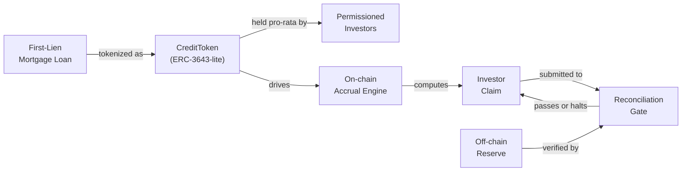

The loan is the root of trust. Everything else — token supply, accrual schedule, investor entitlements — is derived from the loan's terms. The gate is where the off-chain world re-enters the on-chain world: it is the only path through which a claim can result in a distribution, and it will not open unless the reserve proof is current and valid.

### Three-layer mental model

**L1 — Permissioned token.** The [`CreditToken`](../../contracts/src/CreditToken.sol) implements a transfer-restricted ERC-20 whose movement is conditioned on the [`IdentityRegistry`](../../contracts/src/IdentityRegistry.sol) and [`ComplianceRegistry`](../../contracts/src/ComplianceRegistry.sol). This is the ERC-3643 pattern stripped to its essential mechanics: no transfer executes unless both the sender and receiver hold valid identity attestations and the compliance module approves the transfer. The token layer is deliberately thin on policy — it holds balances, enforces transfer rules, and runs the per-holder accrual bookkeeping (`_settleAccrual`, `claimable`, `ratePerSecond`). What does not live here is any awareness of NAV, reserves, or reconciliation.

**L2 — Accrual and NAV.** Accrual itself is on-chain: `CreditToken` settles per-holder interest lazily in `_settleAccrual` and exposes `claimable()` — the contract is the authority on what each holder is owed (the L2 deep-dive below walks the mechanism). This layer's off-chain job is to independently re-derive and police that number. It ingests on-chain events through the indexer ([`indexer/src/ingest.ts`](../../indexer/src/ingest.ts), [`indexer/src/decode.ts`](../../indexer/src/decode.ts)) and replays the full event history into a deterministic state machine ([`api/src/replay/fold.ts`](../../api/src/replay/fold.ts), [`api/src/replay/replay.ts`](../../api/src/replay/replay.ts)) whose integrity is anchored by a rolling hash ([`api/src/replay/hash.ts`](../../api/src/replay/hash.ts)). The NAV bounds module then computes the acceptable range for the reserve given current accrued obligations. L2 is the system's arithmetic — it translates raw events into dollar-denominated obligations and acceptable reserve envelopes.

**L3 — Reconciliation engine.** The engine ([`api/src/recon/engine.ts`](../../api/src/recon/engine.ts)) continuously evaluates the invariants ([`api/src/recon/invariants.ts`](../../api/src/recon/invariants.ts)) that must hold for the system to be solvent: reserve covers accrued principal, reserve covers accrued interest, NAV mark is within bounds, no distribution is outstanding against an unverified reserve. If any invariant fails, the gate closes and remains closed until the condition is resolved and re-evaluated. The engine does not interpolate or smooth — a failed invariant is a hard stop, not a warning. This is the architectural expression of the core idea: the gate is not advisory.

---

## Layer 1 — Permissioned token

The first layer of the system is the on-chain permissioned token: three Solidity contracts that together enforce the rule that only the right people can hold this asset, and that the moment compliance is violated the transaction reverts with an exact, machine-readable reason code. Everything above this layer — the indexer, the reconciliation engine, the API — is reading state that this layer produces. If this layer is wrong, nothing above it can save you.

### Identity storage: what `IdentityRegistry` holds and why

[`IdentityRegistry`](../../contracts/src/IdentityRegistry.sol) is the single on-chain source of truth for investor eligibility. For each wallet address it stores a `Claims` struct with four fields:

- `verified` — the investor has passed KYC. Unverified addresses are categorically excluded from receiving tokens; no other check matters until this one passes.
- `accredited` — the investor qualifies under SEC Rule 501 as an accredited investor. Required for Reg-D offerings (private placements limited to accredited investors).
- `jurisdiction` — an enum (`Unknown`, `US`, `NonUS`). Reg-S offerings restrict tokens to non-US persons; a US-jurisdictioned wallet is ineligible regardless of accreditation status.
- `frozen` — a regulatory hold flag. Frozen wallets are locked out of both sending and receiving tokens. The directionality matters and is discussed in detail below.

**Why a mapping in contract storage, not an event log.** The claims are stored in a `mapping(address => Claims) private _claims` in contract storage — a first-class Solidity slot, not reconstructed by replaying events. This is a deliberate trade-off. An event-sourced approach would have the benefit of a complete audit trail and easy off-chain replay, but it would mean the `_update` hook (which runs on every token movement) would have to either trust a cached read or re-derive state from a log it cannot access. Solidity `view` functions can only read contract storage; they cannot iterate logs. The mapping is the right chokepoint: reads are O(1), atomically consistent with the transaction executing them, and impossible to race. The `ClaimsUpdated` event is still emitted on every mutation — the audit trail exists — but the *authoritative state* that the compliance gauntlet reads is always the mapping, never the log.

**Write access is issuer-gated.** `setClaims`, `setVerified`, `setAccredited`, `setJurisdiction`, and `setFrozen` are all decorated with `onlyRole(ISSUER_ROLE)`. The `ISSUER_ROLE` is granted to the deploying admin at construction time. In the KYC onboarding module (#39), a mock `KycProvider` behind an interface issues verdicts that the issuer signs into on-chain claims via the `submitKyc` mutation — the write path is intentionally a narrow, controllable gate, not a self-service registration endpoint.

### Class structure

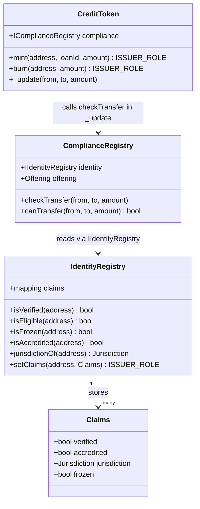

### The compliance gauntlet

[`ComplianceRegistry.checkTransfer`](../../contracts/src/ComplianceRegistry.sol) runs a fixed-precedence sequence of checks. Order is not arbitrary — it encodes which failure is most authoritative. A frozen sender check must precede any receiver check because a freeze is an enforcement action that overrides everything; reporting "receiver not verified" when the real problem is the sender is under a regulatory hold would be misleading. The six steps:

**Step 0 — `SenderFrozen`**. If `identity.isFrozen(from)`, revert immediately with `SenderFrozen(from)`. A frozen holder cannot initiate any outbound movement. This is checked before the receiver to ensure that enforcement holds trump eligibility questions.

**Step 1 — `ReceiverFrozen`**. If `identity.isFrozen(to)`, revert with `ReceiverFrozen(to)`. A frozen address cannot accumulate new tokens. The receiver freeze is checked second rather than merged with the sender freeze so the revert carries the correct address argument in its payload. (Off-chain, `decodeReason` in [`api/src/chain/errors.ts`](../../api/src/chain/errors.ts) maps the decoded error *name* to a typed reason code — the address argument stays on-chain, undecoded — but the two distinct error names still tell an operator which side of the transfer is blocked.)

**Step 2 — `ReceiverNotVerified`**. If `!identity.isVerified(to)`, revert with `ReceiverNotVerified(to)`. An unverified wallet has not completed KYC. Verification is the gating precondition for every subsequent eligibility check; there is no meaningful result from checking jurisdiction or accreditation on a wallet whose identity has not been confirmed.

**Step 3 — `NotEligible` (general)**. If `!identity.isEligible(to)`, revert with `NotEligible(to)`. `isEligible` returns `verified && !frozen`. At step 3, we know the receiver is verified (step 2 passed) and not frozen (step 1 passed), so this check catching a failure here would indicate a race between steps — practically this acts as the Reg-S catch-all for receivers who are verified but whose combined claim state fails general eligibility.

**Step 4a — `AccreditationRequired` (Reg-D path)**. If the offering is `RegD` and `!identity.isAccredited(to)`, revert with `AccreditationRequired(to)`. Regulation D allows securities to be sold only to accredited investors. A verified, unfrozen US wallet that has not been marked accredited is ineligible for a Reg-D token. The offering regime is set once at `ComplianceRegistry` construction and is immutable thereafter — the issuer cannot switch a Reg-D offering to Reg-S after the fact.

**Step 4b — `NotEligible` (Reg-S jurisdiction path)**. If the offering is `RegS` and `identity.jurisdictionOf(to) != Jurisdiction.NonUS`, revert with `NotEligible(to)`. Regulation S exempts offshore offerings from SEC registration; US persons are excluded. The revert code here is `NotEligible` rather than a separate `JurisdictionMismatch` because jurisdiction ineligibility is a form of general ineligibility — adding a sixth transfer-path error code for what is semantically the same outcome would split the error taxonomy without benefit.

See [`Errors.sol`](../../contracts/src/Errors.sol) for the complete typed error definitions.

### Gauntlet decision tree

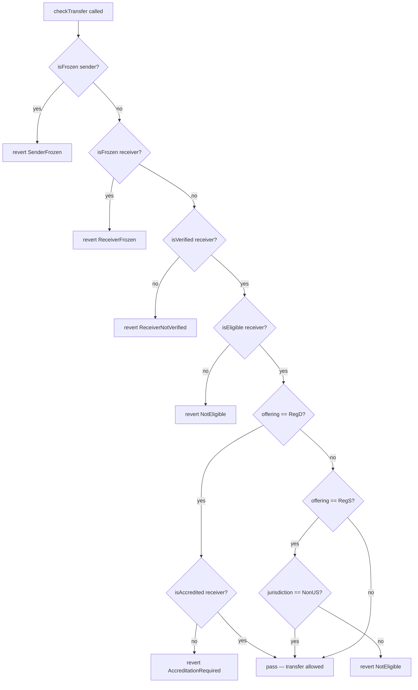

### Typed custom errors: the closed-set argument

The error taxonomy is declared in [`Errors.sol`](../../contracts/src/Errors.sol) as six Solidity custom errors. They are not strings. This is load-bearing.

Custom errors encode to a 4-byte selector derived from the error name and parameter types — the same mechanism as function selectors. Any decoder that knows the ABI can deterministically recover the error kind and its arguments from a raw revert payload. A string revert cannot be pattern-matched reliably; it requires substring search, which is fragile and cannot be made exhaustive. With a finite set of typed errors, you can write a TypeScript switch over the decoded selector that the compiler can verify is exhaustive — add a new error, the switch fails to compile until every consumer handles it.

[`shared/src/reasons.ts`](../../shared/src/reasons.ts) mirrors this closed set as a TypeScript discriminated union:

```typescript
export type ReasonCode =
  | "SenderFrozen"
  | "NotEligible"
  | "ReceiverFrozen"
  | "ReceiverNotVerified"
  | "AccreditationRequired"
  | "InsufficientReserve";
```

The `assertNever` helper at the bottom of that file turns any switch-without-a-default-arm over `DomainError['kind']` into a compile error if a union variant is unhandled. The closed set is enforced at the type level on both sides of the chain boundary, not by convention or documentation. This is how you prevent the ABI-drift landmine: a new error added to Solidity without a matching TS variant causes a build failure, not a silent `0x...` in a GraphQL response that an investor sees and cannot interpret.

The `REASON_CODES` and `ENGINE_STATES` arrays enable exhaustiveness tests and the GraphQL error enum without manual maintenance — the single source of truth is the union type; the arrays are derived from it.

### The `_update` hook: why it is the right chokepoint

[`CreditToken._update`](../../contracts/src/CreditToken.sol) overrides the OpenZeppelin ERC-20 v5 internal hook that fires on every balance-changing operation — `mint`, `transfer`, `transferFrom`, and `burn`. The compliance check runs inside `_update`, not in a wrapper on the public-facing functions.

This matters because the ERC-20 interface has multiple entry points that move tokens: `transfer`, `transferFrom` (via approvals), and `mint`/`burn` for issuance. If the check lived in a `transfer` override but not in `transferFrom`, an attacker or a careless integration could route around it by first calling `approve` then `transferFrom`. The `_update` hook cannot be bypassed; OZ v5 guarantees that every balance mutation calls `_update` exactly once. There is no public function in the ERC-20 surface that moves balances without touching it.

The hook's structure is:

```solidity
function _update(address from, address to, uint256 amount) internal override {
    if (to != address(0)) {
        compliance.checkTransfer(from, to, amount);
    }
    if (from != address(0)) _settleAccrual(from);
    if (to != address(0)) _settleAccrual(to);
    super._update(from, to, amount);
}
```

The compliance check runs before `super._update` — if the gauntlet reverts, no balance mutation occurs. The accrual settlement runs on pre-change balances for the same reason: interest earned up to this moment is computed against the current balance before the transfer shifts principal.

Burns skip the compliance check (`to == address(0)` guard). This is intentional: issuer-initiated clawback must work even if the holder is frozen. The ability to reclaim tokens from a sanctioned wallet is a regulatory requirement; a compliance check that blocked clawback would make freeze a one-way trap with no remediation.

### Transfer flow: sequence diagram

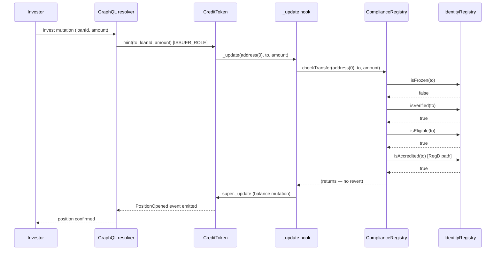

If any identity check returns the wrong value, `checkTransfer` reverts with the appropriate typed error. The transaction is rolled back atomically; `PositionOpened` is never emitted; the GraphQL layer decodes the revert selector against the reason-code map and returns a structured error to the investor.

### The freeze model

Freeze is a complete bidirectional lockout. `SenderFrozen` blocks outbound transfers; `ReceiverFrozen` blocks inbound. Both directions matter for a regulated security, and the reason is not symmetric.

**Outbound freeze** prevents a sanctioned investor from liquidating their position, transferring tokens to an accomplice, or otherwise disposing of an asset under a regulatory hold. This is the intuitive case — "frozen" means "cannot sell."

**Inbound freeze** is less obvious but equally important. A sanctioned entity should not be able to accumulate regulated securities even as a recipient of a gift or an internal corporate transfer. More practically: in a OFAC-type sanction scenario, the regulator's intent is that the sanctioned party should not hold the asset at all. If freeze only blocked outbound movement, a workaround would be to first freeze someone, then have a third party mint or transfer tokens *to* them before the freeze was enforced — `ReceiverFrozen` closes that gap. The freeze is symmetric by design, not by oversight.

Freeze state is set by `ISSUER_ROLE` via `setFrozen`. It takes effect immediately on the next transaction touching that address — there is no grace period, no pending state. Every `setFrozen` call emits `ClaimsUpdated`, but the indexer does not currently consume that event: the off-chain `identities` table is seeded from the deploy manifest (`seedReference` in [`indexer/src/seed.ts`](../../indexer/src/seed.ts), mirroring `Identities.sol` exactly), and the reconciliation engine's I4 invariant (`IdentityValid`) reads that table to confirm no current token holder is frozen or unverified. `ClaimsUpdated` is therefore an emitted-but-not-yet-consumed hook — a production system that mutates claims after genesis would project it into the read model through the same ingest pipeline; in the current system the seeded set is the source of truth on both sides, so the event is an audit trail and an extension point, not a live pipeline.

### What is cut from full ERC-3643

ERC-3643 (the T-REX standard) is the canonical framework for permissioned security tokens on EVM chains. This implementation is explicitly described as "ERC-3643-lite." Three significant components are omitted:

**ONCHAINID and the claim-issuer hierarchy.** Full ERC-3643 uses the ONCHAINID protocol: each investor has their own identity smart contract, and claims (like KYC verification) are issued by trusted third parties who sign them on-chain. The trusted-issuers-registry tracks which claim issuers are authorized to issue which claim types. This is a powerful model for multi-party issuance — a transfer agent, a bank, and a regulator can each issue different claim types — but it adds substantial contract surface, a bespoke identity-resolution lookup on every transfer, and a whole secondary ecosystem of deployed contracts. For a single-issuer, single-loan-series system being built to prove reconciliation correctness, that overhead is pure noise. The issuer plays all three roles; the `ISSUER_ROLE` guard on `setClaims` is the trust boundary, and it is simpler, auditable, and sufficient.

**ERC-1400 partitions.** ERC-1400 adds the concept of token partitions — subsets of a total balance with different transfer rules. This enables senior/junior tranching within a single token contract, with different compliance rules per partition. The design decision to keep a single-class token is documented explicitly: tranching is deliberately cut — there is no waterfall model anywhere in this codebase, on-chain or off — and named as the next asset module (see the build-vs-buy boundaries in the final section), because the reconciliation engine's correctness proof is already complex enough without partition-aware balance accounting. Adding partitions on-chain before the core reconciliation invariants are proven would be building on an unproven foundation.

**Trusted-issuers-registry.** In ERC-3643, claim verification is delegated to a registry of trusted claim issuers, each approved for specific claim topics. This enables institutional workflows where KYC is handled by a licensed provider and the token contract trusts their attestations without the issuer needing to re-verify each one. In this system, the KYC onboarding module (#39) introduces a mock `KycProvider` behind an interface that feeds into `ISSUER_ROLE`-signed `setClaims` calls — the architecture is claim-issuer-ready at the interface level, but the on-chain trusted-issuers-registry is cut because it is unnecessary complexity for the single-issuer demo scope.

The cuts are not shortcuts — they are the honest scope boundary. The system that exists is simpler, more auditable, and correctly solves the stated problem. Full ERC-3643 compliance is an extension point, not a missed requirement.

---

## Layer 2 — Accrual and NAV

### What Accrual Is

Every holder of a CreditToken position accrues interest continuously from the moment their position is opened. The mechanism is intentionally simple: interest is a linear function of three inputs — the holder's token balance, the loan's `ratePerSecond`, and the number of seconds that have elapsed since the holder's last settlement. The accumulation is *lazy*: no clock ticks on-chain, no scheduled job runs, and no per-holder storage is written until something forces a settlement. What forces settlement is any balance-changing event or an explicit `claim()` call.

The full accrual bookkeeping lives in [`../../contracts/src/CreditToken.sol`](../../contracts/src/CreditToken.sol). The core data structure is a per-holder `Accrual` struct:

```solidity
struct Accrual {
    uint64 lastAccruedAt;    // accrual-clock instant of last settle
    uint64 haltedSnapshot;   // haltedElapsed captured at that settle
    uint256 accrued;         // settled-but-unclaimed interest
}
```

`_settleAccrual` is the function that folds elapsed time into `accrued`. It computes the span since the last settle, subtracts any time the series spent in a halted state (DEFAULT or NAV freeze), multiplies by balance and rate, and appends the result:

```solidity
uint64 elapsed = span > halted ? span - halted : 0;
a.accrued += (balanceOf(holder) * ratePerSecond * elapsed) / RATE_SCALE;
```

`RATE_SCALE` is `1e18`, giving enough precision that a small rate applied over a 365-day warp does not overflow at the seeded principal sizes. The design deliberately avoids per-block state writes — `_settleAccrual` runs only when triggered by `_update` (on any balance change) or `claim()`. This keeps gas costs proportional to actual activity, not to the passage of time.

The *read-only* view `claimable(address)` computes the same pending slice without writing state, giving the indexer and UI a live preview of what a holder could claim right now without sending a transaction.

### Why Halt Gaps Must Not Accrue

A naive implementation would accumulate interest for every second since `lastAccruedAt`, including seconds when the loan was in DEFAULT or the accrual was frozen. The `haltedElapsed` counter exists to subtract exactly the halted duration without iterating over holders. When a halt begins, `accrualEndsAt` is stamped to the current timestamp. While halted, `_accrualClock()` returns `accrualEndsAt` rather than `block.timestamp`, so every call to `_settleAccrual` during the halt computes zero elapsed time. When the halt ends (DEFAULT recovery only — not NAV freeze), `haltedElapsed` is incremented by the duration of the halt, and `accrualEndsAt` is cleared. On the next settle, each holder's `haltedSnapshot` (captured at their last settle) is subtracted from the current `haltedElapsed`, isolating the halted gap that fell inside *their* span. Holders who were settled before the halt, during the halt, and after the halt all arrive at the same correct answer without any eager enumeration.

### Accrual + Claim Lifecycle

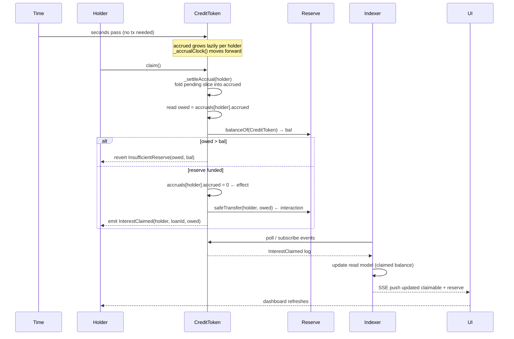

### Checks-Effects-Interactions and Why It Matters Here

`claim()` is a textbook reentrancy surface: it reads a balance, then sends value to the caller. If the reserve token were a malicious contract (or a future ERC-777 hook were introduced), a naive implementation that resets `accrued` *after* the transfer would allow the recipient to re-enter `claim()` before the zeroing, paying out the same accrual twice per call depth.

The implementation in [`../../contracts/src/CreditToken.sol`](../../contracts/src/CreditToken.sol) applies the checks-effects-interactions (CEI) pattern with belt-and-suspenders defense:

1. **Check** — `if (owed > bal) revert InsufficientReserve(owed, bal)` before touching any state.
2. **Effect** — `accruals[msg.sender].accrued = 0` before any external call.
3. **Interaction** — `reserve.safeTransfer(msg.sender, owed)` executes last, after the state is already settled.
4. **Guard** — the `nonReentrant` modifier from OpenZeppelin's `ReentrancyGuard` provides a lock even if a future refactor accidentally reorders steps.

The invariant is: after `claim()` returns, `accrued` for the caller is zero *and* the reserve has transferred exactly `owed`. There is no window in which `accrued` is nonzero and the transfer has already occurred, nor a window in which the transfer is in flight and `accrued` is still readable as positive.

### What a NAV Mark Is

A NAV (net asset value) mark is the servicer's periodic valuation of the underlying loan, expressed in basis points of par. A mark of `10000 bps` means the loan is valued at par; `9500 bps` means a 5% discount. Marks flow from an off-chain feed (in production, a valuation agent or servicer system) into the platform's NAV ingestion pipeline. The platform does not trust marks blindly — a feed with a software bug, a stale connection, or a bad actor could push a mark that would misrepresent the loan's value and allow claimable balances to drift from economic reality. The acceptance gate exists to refuse marks that fail basic sanity checks before they can influence distribution.

### The NAV Acceptance Gate: `withinBounds`

The acceptance logic is a pure function in [`../../api/src/nav/bounds.ts`](../../api/src/nav/bounds.ts). "Pure" here is a deliberate design constraint: `withinBounds` has no I/O, no database calls, and no internal clock. The current timestamp `now` is injected as a parameter. This means the replay harness can deterministically re-derive NAV acceptance decisions without any external state, using only the event log.

The function checks four rejection conditions in a fixed order. The order is load-bearing: it ensures the recorded rejection reason is deterministic when multiple conditions might be true simultaneously.

**1. UnknownLoan** — If the loan ID is not present in the read model, the mark is rejected immediately. Accepting a mark for a loan that does not exist would corrupt the feed baseline.

**2. Stale** — The mark's `observedAt` timestamp must be within `maxStalenessSec` of `now` (default: 3600 seconds, one hour). A mark observed more than an hour ago is no longer fresh enough to drive distribution decisions. This check uses wall-clock proximity rather than block timestamps to stay in the off-chain domain where feed latency is measured.

**3. NonMonotonicTimestamp** — A mark must be strictly newer than the last *accepted* mark for this loan. A duplicate or replayed mark — one with an `observedAt` equal to or earlier than the previous accepted mark's timestamp — is rejected. The key subtlety is "last accepted, not last received": a rejected mark does not update the baseline. If it did, a sequence of one-bad-mark followed by one-good-mark could shift the comparison baseline downward, making a subsequent large jump look smaller than it is. That is the cascade landmine the CLAUDE.md calls out explicitly.

**4. OutOfBounds** — The absolute basis-point jump between the new mark and the last accepted mark must not exceed `maxJumpBps` (default: 2000 bps, ±20%). A +40% jump (4000 bps) — as in matrix row 9 — exceeds this bound and is rejected as `OutOfBounds`.

```typescript
export const NAV_BOUNDS = {
  maxJumpBps: bps(envInt("NAV_MAX_JUMP_BPS", 2000)),
  maxStalenessSec: envInt("NAV_MAX_STALENESS_SEC", 3600) as UnixSeconds,
} as const;
```

### NAV Acceptance Decision Tree

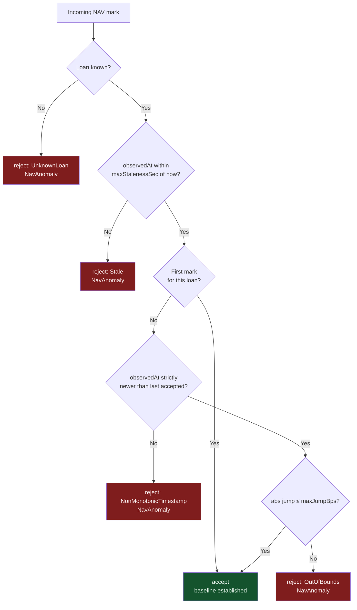

### Why the Bound Must Be Identical Everywhere It Is Evaluated

`NAV_BOUNDS` appears as a single exported constant in [`../../api/src/nav/bounds.ts`](../../api/src/nav/bounds.ts). Both consumers of a NAV verdict — the ingestion gate (`ingestNav`) and the replay path that re-derives NAV acceptance deterministically from the event log — import that one constant. If the gate used a different bound than the replay's re-derivation, the two sides would make different decisions about which marks are valid: the engine might compute expected state assuming a mark was accepted (because its bound accepted it) while the gate had already halted on it. The invariant check I3 (`NavInBounds`) would then fire as a spurious halt — an anomaly that exists only because two copies of the same threshold drifted. The only defense is a single constant that every evaluator imports. Any configuration divergence (e.g., one side reading a different environment variable) produces a false halt that looks like a real anomaly from the inside.

The same argument extends to the chain. `CreditToken.freezeAccrual()` is the named on-chain hook for this gate — but it is currently unwired (next section). If it were ever wired with its own copy of the bound rather than as a downstream consequence of the off-chain verdict, on-chain accrual and the engine's replica would disagree in exactly the way described above. The single-constant discipline is what keeps that extension safe to build.

### What a NavAnomaly Actually Freezes

When a mark is rejected as `NavAnomaly`, [`../../api/src/nav/gate.ts`](../../api/src/nav/gate.ts) writes exactly two rows: the rejected reading into `nav_readings` (`accepted = false`, with the typed reject reason) and a halt row into `recon_status` (`state = 'NavAnomaly'`, `failed_invariant = 'NavInBounds'`). **That halt row *is* the freeze.** Everything off-chain that advances or evaluates accrual keys off `recon_status`: [`../../api/src/nav/accrualGate.ts`](../../api/src/nav/accrualGate.ts) exposes `isAccrualFrozen` — a loan is frozen while its most recent NavAnomaly halt has not been superseded by a later clean (`ok = true`) cycle — and `accrualMultiplier`, the 0-or-1 factor for the display ticker. The reconciliation engine's snapshot loader calls `isAccrualFrozen` for every loan on every cycle; a frozen loan lands in `anomalousLoans`, which is precisely what invariant I3 (`NavInBounds`) fails on. And because every distribution path reads `recon_status` before broadcasting, the halt row also blocks payouts the instant it commits.

The contract has a matching hook:

```solidity
function freezeAccrual(uint256 loanId) external onlyRole(ISSUER_ROLE) {
    accrualFrozen = true;
    if (accrualEndsAt == 0) accrualEndsAt = uint64(block.timestamp);
    emit AccrualFrozen(loanId);
}
```

It stamps `accrualEndsAt` (if not already halted) and sets `accrualFrozen`; from that point `_accrualClock()` returns the frozen instant, so no further interest accrues on-chain, while interest earned up to the freeze is preserved in each holder's settled `accrued`. But the gate does not call it. `freezeAccrual()` is exercised only by the Solidity test suite today — a named, ready extension point, not a wired consequence. That is a real production gap, stated plainly: until the gate's rejection path submits an issuer-signed `freezeAccrual(loanId)` transaction, on-chain `claimable()` keeps growing through a NavAnomaly halt, and only the off-chain halt (which blocks every distribution path) prevents that growth from ever paying out. Closing the loop is a small, well-defined change — the API process already holds the issuer signer for its other write paths — and it would make the on-chain ledger *agree with* the freeze instead of merely being gated by it.

### Full NAV Spike Scenario — Matrix Row 9

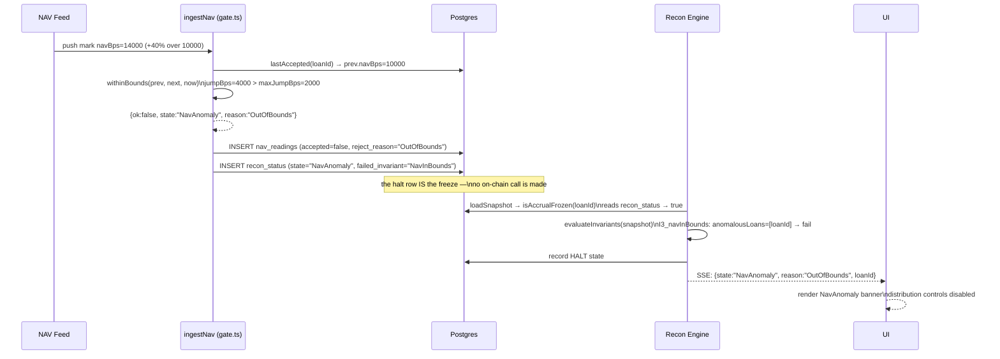

In the running stack, a mark arrives through the `submitNav` mutation, which feeds `ingestNav` — the Health view's demo control drives this exact path (loan 1, 14000 bps). The sequence has no human in the loop between the bad mark arriving and the freeze taking effect. The gate is synchronous from the feed's perspective: by the time `ingestNav` returns, the rejected reading and the `recon_status` halt row are committed — and because every off-chain accrual evaluation and every distribution path keys off `recon_status`, the freeze is in force the instant that insert commits. The engine's next evaluation cycle (the driver runs one every two seconds) will find the anomalous loan in the snapshot and confirm the halt. The on-chain `accrualFrozen` flag, by contrast, stays untouched on this path — the unwired hook described above.

### Why the Freeze Is Sticky

`accrualFrozen` is a boolean flag that is never cleared by any automatic process. The `setLoanStatus` function, which resumes accrual after a DEFAULT recovery, explicitly checks `!accrualFrozen` before clearing `accrualEndsAt`:

```solidity
} else if (newStatus != LoanStatus.DEFAULT && !accrualFrozen && accrualEndsAt != 0) {
    haltedElapsed += uint64(block.timestamp) - accrualEndsAt;
    accrualEndsAt = 0;
}
```

A NAV-frozen series cannot be un-frozen by a loan status change. This is intentional: a NAV anomaly is an integrity signal, not a transient condition. The servicer may have pushed a corrupt mark, the feed may be under manipulation, or the valuation model may have a bug. Any of these warrant human review before distribution resumes. Automatically clearing the freeze on the next valid mark would allow a bad actor to alternate good and bad marks, briefly halting and resuming distribution while obscuring the underlying data quality problem.

Unfreezing requires a deliberate operator action — a separate contract call or admin governance step — that is out of scope for the automated pipeline. The engine remains in HALT state, the UI continues to show the NavAnomaly banner, and no distribution proceeds until an operator, having reviewed the anomaly, explicitly clears the freeze. That review step is the product. The freeze is not an error to be recovered from; it is the system doing exactly what it was built to do.

---

## Layer 3 — Reconciliation engine and deterministic replay

### Why not just call `balanceOf()`?

The naive approach to verifying a tokenized credit system is to call `balanceOf(holder)` on-chain and compare it to a servicer spreadsheet. This approach fails in three distinct ways, and understanding each failure mode explains every design decision in this layer.

First, `balanceOf` returns the current ERC-20 balance — the number of tokens a holder owns — not their accrued but unclaimed interest. In this system, accrual accumulates continuously against each position; a holder may own 1,000 tokens and have accrued 47 USDC of interest that has not yet been claimed. The ERC-20 balance tells you nothing about claimable. You need the event history to reconstruct how much interest has accrued against each position since it was opened.

Second, even if you had the claimable balance, you still cannot prove solvency from on-chain state alone. The on-chain system knows what holders are owed; it does not know whether the off-chain servicer has actually collected that cash from the borrower. Tokenized-RWA systems fail silently when accrual outruns collection — the token says "47 USDC claimable" but the servicer's bank account does not have 47 USDC. That discrepancy is invisible to any on-chain query.

Third, there is no canonical history in the ERC-20 state root. The current balance is a summary; the path that produced it is gone. Reconstructing *how* balances arrived at their current values, and verifying that the path was legitimate, requires replaying the event log. You cannot detect a double-credit, an incorrect accrual reset, or a reserve underflow from a point-in-time balance query.

The reconciliation engine solves all three problems by treating the event log as the primary source of truth and materializing claimable state from scratch on every cycle.

---

### Chain events as a data structure

Every meaningful on-chain action in this system emits a typed EVM log. The indexer's first job is to decode that raw log into a structured `ChainEvent`. As defined in [`../../indexer/src/decode.ts`](../../indexer/src/decode.ts), decoding produces:

- **`id`** — the canonical `EventId`, formatted as `txHash:logIndex` (e.g. `0xabcd…:3`)
- **`blockNumber`** — the block in which the log was mined
- **`logIndex`** — the zero-based index of this log within that block
- **`name`** — the event discriminant: `PositionOpened`, `Transfer`, `InterestClaimed`, or `LoanStatusChanged`
- **`token`** — the address of the emitting `CreditToken` contract, which maps 1:1 to a loan
- **typed payload** — event-specific fields (holder, amount, loan, status) as branded scalar types from `@pcl/shared`

The discriminated union structure is intentional about where it is strict. `decodeChainEvent` returns `null` for logs it does not project — `Approval`, `RoleGranted`, `AccrualFrozen` and other emissions outside the read model — so unrelated logs are skipped without polluting the projection. But within the events it claims to understand, drift is a hard error: a log missing its `txHash`/`logIndex`/`blockNumber`, a `LoanStatus` index outside the known enum, or a `Transfer` from a token address with no manifest mapping all throw immediately. The line is drawn between "not ours to project" (safe to skip) and "ours but malformed" (never safe to guess): silently mis-projecting a known event would surface two cycles later as a spurious `ReconMismatch` that masks its real cause — a stale decoder — so those paths fail at the ingestion layer instead.

---

### Why `txHash:logIndex` is the deduplication key

The indexer must be idempotent. Re-ingesting a log that was already processed — due to a WebSocket reconnect, a block reorg followed by reingestion, or a cold-start replay — must be a no-op. The dedup key determines whether an event is treated as new or already-seen.

The key is **`txHash:logIndex`**, not `blockNumber:logIndex`. This distinction matters during reorgs. When a block is orphaned and the same transactions are re-mined into a different block, the `blockNumber` changes but the `txHash` does not — a transaction hash is a hash of the transaction content, which is independent of which block ultimately includes it. Using `blockNumber:logIndex` as the dedup key would treat a re-mined transaction as a new event and double-ingest it.

The `txHash:logIndex` pair is globally unique. A transaction can only appear in the canonical chain once; the log index is deterministic within a transaction's execution. Together they identify a specific EVM effect with no ambiguity across reorgs.

The ordering key for the replay fold is separate: events are sorted by `(blockNumber, logIndex)` to establish causal order. The dedup key and the ordering key solve different problems and are deliberately kept distinct.

---

### Indexer lifecycle

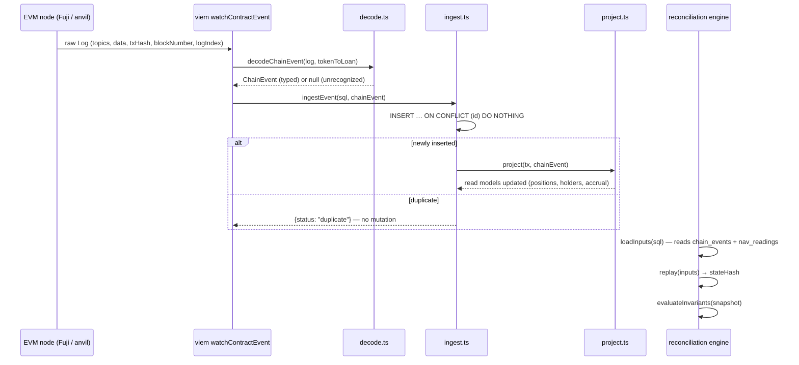

The insert-then-project step happens in a single database transaction. If projection fails after a successful insert, the transaction rolls back and the event is not recorded as ingested — the next delivery will re-attempt the full insert+project pair. There is no window in which an event is stored but not projected, or projected but not stored.

---

### The replay fold

The replay fold, implemented in [`../../api/src/replay/fold.ts`](../../api/src/replay/fold.ts), is the system's verification oracle. It takes a list of `ReplayInput` values — an unordered set of chain events and NAV readings — and reduces them into a `ReplayState` that captures per-holder position balances, the reserve balance, the latest accepted NAV per loan, and any halt condition.

The fold is a pure function. It performs no I/O, no database queries, and no wall-clock reads. The only "external" input is the deterministic clock `now`, which `replay.ts` derives from the inputs themselves — specifically, the maximum `observedAt` timestamp across all NAV readings. Because `now` is a function of the input set rather than the real clock, the fold produces identical output for any permutation of the same inputs. A `Date.now()` call anywhere in the fold would silently break this property in CI by making the output time-dependent — the comment in `fold.ts` explicitly names this as a landmine.

The fold order for chain events follows `(blockNumber, logIndex)`, establishing causal ordering: mints before transfers, transfers before claims. NAV readings sort by `(observedAt, source, navBps)`. The two keyspaces are separated by a kind prefix (`0:` for chain, `1:` for nav) so chain events always precede NAV readings at the same numeric position. Any set of inputs has exactly one canonical fold order.

Clone-on-write is used throughout — `applyInput` never mutates its input state, returning a fresh copy with each step. This makes the fold safe to run speculatively and makes the interleaving property trivially checkable: any permutation of inputs, when sorted and folded, arrives at the same `ReplayState`.

---

### The stateHash: an integrity fingerprint

After folding, the state is fingerprinted by [`../../api/src/replay/hash.ts`](../../api/src/replay/hash.ts). The `stateHash` is a `keccak256` of the canonical JSON serialization of the `ReplayState`. Three determinism hazards are explicitly addressed:

**JSON key order.** JavaScript objects have insertion-order iteration, which varies by construction path. `canonicalize` never serializes the live state directly — it builds a fresh object literal with a fixed, hard-coded key order, so the serialized form is constructed, not inherited from whatever insertion order produced the state.

**Map iteration order.** ES6 Maps iterate in insertion order. Before serializing, every Map (positions, navByLoan) is converted to an array of entries sorted on a stable string key.

**BigInt serialization.** `JSON.stringify` throws on BigInt values by default. Every `Usdc6` value routes through `usdc6ToString` before entering the canonical form.

There is one additional subtlety worth noting: `openedAt` is stamped from the `PositionOpened` block number, which is an artifact of Foundry's transaction-to-block batching rather than ledger state. A toolchain version bump — specifically Foundry 1.5.1 repacking 19 deploy transactions into different blocks — would change the raw block number and therefore the hash even with zero logic change. The canonical form normalizes this to an open-ordinal: the rank of each position's open-block in ascending order (0, 1, 2, …). The fingerprint then depends on what opened and in what relative order, not where on chain it happened to land.

The result is a single 32-byte value. Equal event sets in any arrival order produce the same hash. A 1-base-unit change anywhere produces a different hash. This is the headline property.

---

### Interleaving-independence and why it matters

The indexer is async and resumable. Events may be delivered out of order across WebSocket reconnects, re-ingested during restarts, or re-sorted by the database SELECT. The reconciliation engine must not be sensitive to the arrival order of events — only to the causal order implied by `(blockNumber, logIndex)`.

This is not a theoretical concern. In the actual deployment, the indexer may receive block N+1's events before block N's if a WebSocket delivery races; a cold-start replays from the stored cursor which may differ by restart timing; a reorg re-delivers events that are already stored as no-ops via the dedup key. In all of these cases, the set of processed events is the same — only the order in which they were encountered changes.

The property test in [`../../api/test/replay.interleaving.prop.test.ts`](../../api/test/replay.interleaving.prop.test.ts) generates arbitrary input pools with fast-check — mints across distinct holders plus monotonic NAV marks — and asserts that every Fisher-Yates permutation of the same `ReplayInput[]` produces an identical `stateHash`. This is a fast-check property, not a single happy-path assertion, and it is pure (no database, no chain, no clock), so it runs at ≥256 cases without flaking. The scenario matrix exercises a related but distinct property: [`../../scripts/verify_matrix.ts`](../../scripts/verify_matrix.ts) re-runs the 10 scenario rows in 64 random orderings and asserts the per-row verdicts are order-independent. One property pins the fold's arithmetic; the other pins the harness's row isolation.

---

### From inputs to verdict: the engine's control flow

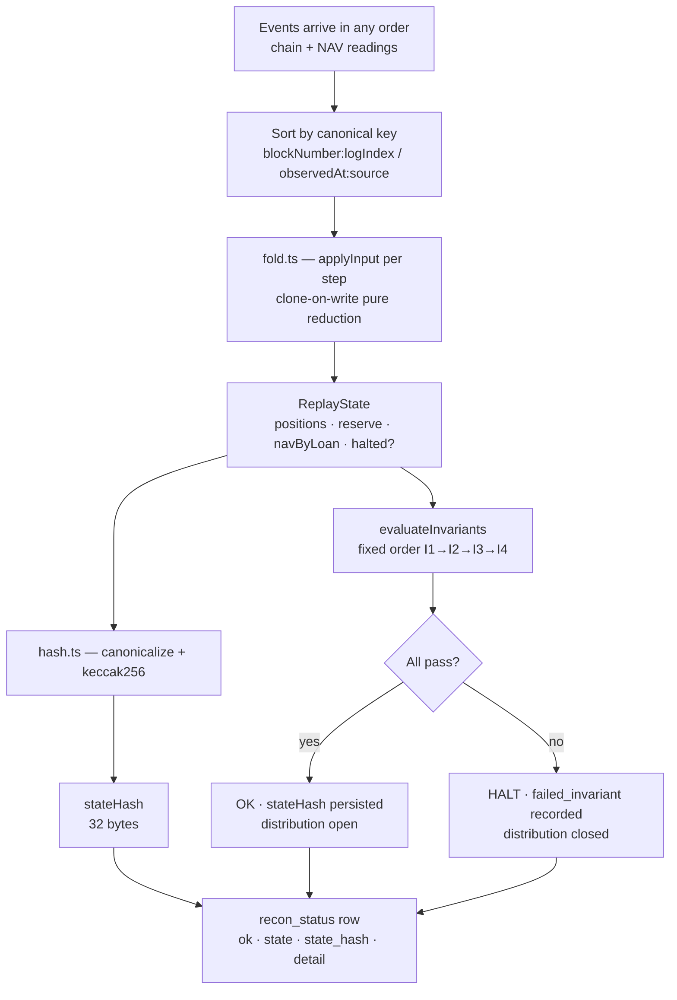

---

### Full vs incremental replay

The current engine performs a **full replay from genesis on every reconciliation cycle**. It loads the complete `chain_events` and `nav_readings` tables, sorts them, folds from an empty initial state, and evaluates invariants against the resulting `ReplayState`.

The obvious alternative — incremental replay, where a snapshot at time T is persisted and only events after T are folded — is deliberately avoided. Incremental replay requires proving snapshot correctness, which is the same problem recursively: you need to trust that the snapshot faithfully represents the state that a genesis-fold would have produced, which means you need either a trusted genesis fold at some prior checkpoint (which is what you were trying to avoid) or a cryptographic commitment scheme that defeats the purpose.

Full replay sidesteps this entirely. The fold is deterministic and the inputs are append-only; the result is guaranteed to be correct as long as the input tables are correct, which is verified separately by the dedup key's idempotency guarantee. There is no snapshot to corrupt, no checkpoint format to migrate, and no risk of a compaction bug silently changing the answer.

At the current scale — 6 loans, demo-sized position sets — full replay costs less than a millisecond. The optimization path (checkpoint the stateHash at a known block height and fold only the delta) is named here as the obvious Phase 2 optimization when loan count and event volume grow. It would not change the correctness argument, only the computational cost.

---

### The four invariants

Invariants are evaluated in a **fixed, documented order**. The order is not incidental — it determines which `failed_invariant` is recorded when multiple invariants would fail simultaneously, and the scenario matrix row 10 test asserts a specific `ReconMismatch` outcome that would be flaky if evaluation order were non-deterministic.

The implementation in [`../../api/src/recon/invariants.ts`](../../api/src/recon/invariants.ts) exposes the four predicates and a `INVARIANTS` array in fixed order, iterated by `evaluateInvariants` which short-circuits on the first failure:

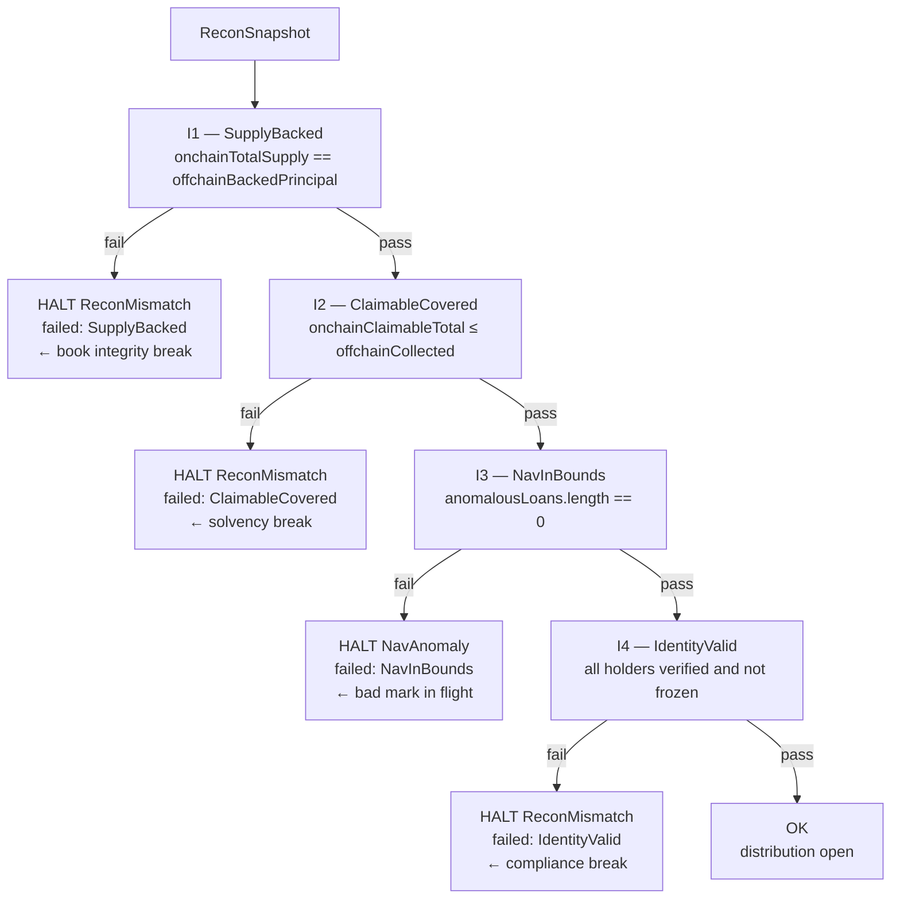

---

### I1 vs I2: two different failure modes

These two invariants are often conflated but protect against entirely different classes of failure.

**I1 — SupplyBacked** asks: does the on-chain token supply match what the off-chain book says should exist? This is a supply integrity check. `onchainTotalSupply` is read from the ERC-20 contract; `offchainBackedPrincipal` is the sum of principal positions tracked in the indexer's read models. A drift between them means the indexer's projection and the chain disagree about how many tokens exist — either a mint was missed by the indexer, the indexer double-counted a position, or an ABI mismatch caused a Transfer event to be decoded incorrectly. The fix is a projection bug, not a cash problem. Paying out more or fewer distributions would not fix I1.

**I2 — ClaimableCovered** asks: can we actually pay what we owe? `onchainClaimableTotal` is the sum of all accrued interest across all holder positions, read from the on-chain state. `offchainCollected` is the cash the servicer has actually collected from the borrower and deposited into the reserve. The invariant checks `claimableTotal ≤ collected` — a strict less-than-or-equal, not equality, because over-collection is fine; under-collection is not. A failure here means the system would have to pay out money it does not have. The fix is a servicer action (collect more cash) or a distribution halt until cash arrives. Matrix row 10 trips this invariant by reporting collected cash (the `reportCash` mutation) one unit below the aggregate claimable total.

The asymmetry of the check (`≤`, not `=`) is also intentional. Equality would mean the reserve is exactly drained by distribution — a fragile condition that would halt on any timing difference between cash arrival and distribution. The invariant is a solvency gate, not a balance sheet identity.

---

### Fail-closed: why HALT beats best-effort

Every value-moving mutation in the API routes through `broadcastGated` ([`../../api/src/resolvers/mutations.ts`](../../api/src/resolvers/mutations.ts)), which calls `isDistributionHalted()` before any chain interaction. The check reads the latest *persisted* `recon_status` row — kept fresh by the reconciliation driver, which runs a cycle every two seconds and once on boot. If that row has `ok = false`, the broadcast is refused entirely — no partial payments, no prorated payouts, no "best effort given current data." The system halts.

This is the correct choice, and the reasoning is asymmetric:

**Overpaying** — distributing value that isn't there — is **unrecoverable**. Once USDC leaves the reserve to a holder, recovering it requires legal recourse against the holder, or absorbing the loss. In a system with multiple holders across multiple jurisdictions, this is effectively permanent damage to the pool.

**Refusing to pay** is **always recoverable**. A halted distribution means holders wait. That is an operational problem with a known remediation path: fix the invariant violation (collect more cash, correct the ABI drift, unfreeze the identity, submit a corrected NAV mark), run the reconciliation cycle again, and distribution reopens. No value is destroyed; the halt is a pause, not a loss.

The fail-closed philosophy also forces bad state to be visible. A best-effort system that pays what it can and logs a warning degrades silently — the warning is seen hours later, by which point the mismatch has widened. A HALT is loud, immediate, and blocks every downstream action that depends on distribution correctness, forcing the operational team to address the root cause before anything else can proceed.

This is expressed structurally, not just by convention: `broadcastGated` reads the latest persisted reconciliation verdict *first* and throws a typed `ReconHaltError` (carrying the engine state, `NavAnomaly` or `ReconMismatch`) before any transaction is sent to the chain. The verdict it reads is never stale by more than one driver tick, and the operator mutations (`submitNav`, `reportCash`) additionally run a reconciliation cycle inline so their verdict returns immediately rather than waiting for the next tick. The guard cannot be bypassed without modifying the control flow; there is no configuration flag to run in "degraded mode." (`assertCanDistribute` in [`../../api/src/recon/halt.ts`](../../api/src/recon/halt.ts) is the throwing variant of the same `recon_status` check — currently exercised only by the test harness, the mutations use `isDistributionHalted` directly.)

---

## Database Schema and Read Models

The persistence layer is deliberately minimal: one Postgres database, hand-written SQL, no ORM, no message broker. This section explains the schema, how each table is written and read, and why those choices hold up under the failure modes that matter — reorgs, restarts, and replay.

### Why Postgres and raw SQL

The core question is: what does the engine actually see when it runs a query? With an ORM, the answer is "whatever the ORM decides to generate." Hibernate-style lazy loading, Sequelize eager associations, Prisma's implicit `SELECT *` — all of these can silently add joins, subqueries, or column fetches that change query cost and, more dangerously, make it unclear whether an index is actually being used.

This codebase's two hot paths — the reconciliation engine in [`../../api/src/recon/engine.ts`](../../api/src/recon/engine.ts) and the NAV gate in [`../../api/src/nav/gate.ts`](../../api/src/nav/gate.ts) — read exactly the columns they name. The recon engine loads `positions`, joins nothing, and aggregates in application code. The NAV gate reads `nav_readings` filtered by `(loan_id, accepted)`, anchoring on the last *accepted* row. At this scale these are trivially cheap queries; what raw SQL buys is that the cost of each one is visible in source, and a framework upgrade cannot silently change the access path.

There is also an auditability argument. Every query that touches chain state is a string literal visible in source. When a reconciliation cycle fails and an invariant flags a balance mismatch, you trace the bug through readable SQL, not through ORM internals. This is not a "we hate ORMs" position — it is a "the cost of hidden query behavior is higher than the cost of writing SQL" position for a financial ledger.

Postgres specifically over SQLite or MySQL: JSONB for the `payload` column lets the indexer store the raw decoded log without a schema migration every time a new event type is introduced. `ON CONFLICT DO NOTHING` is part of the SQL standard but Postgres implements it cleanly for the idempotency pattern described below. `TIMESTAMPTZ` stores all timestamps as UTC with timezone metadata, eliminating an entire class of DST bugs in reporting.

### Entity Relationship

The full schema is twelve tables: `applied_migrations`, `chain_events`, `identities`, `indexer_cursor`, `loans`, `nav_readings`, `optimistic_positions`, `positions`, `properties`, `recon_status`, `reserve`, `tx_status`. The diagram shows the nine that carry the read-model and reconciliation story; `applied_migrations` is covered under the migration system below, and `tx_status` / `optimistic_positions` belong to the optimistic-UX path, not reconciliation (optimistic rows are excluded from every reconciliation query by design).

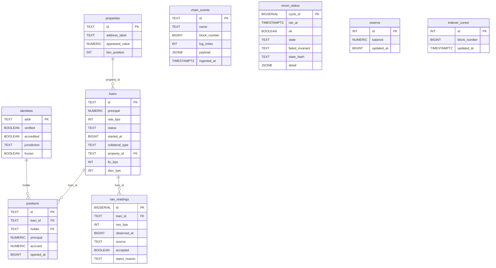

Four of these entities deliberately have no foreign keys. `chain_events` is the append-only input log, keyed only by EventId. `reserve` and `indexer_cursor` are single-row tables (`id = 1` enforced by a check constraint). And `recon_status` is *global* — there is no `loan_id` column, because a reconciliation cycle is one verdict over the whole ledger, not a per-loan score (see below).

### Table-by-Table Ownership

**`chain_events`** is the append-only log of every decoded EVM log that the indexer has ingested. The indexer writes it in [`../../indexer/src/ingest.ts`](../../indexer/src/ingest.ts) using the idempotency pattern described below. Nothing deletes from this table. It is the ground truth record of what happened on-chain from the indexer's perspective. The replay engine in [`../../api/src/replay/replay.ts`](../../api/src/replay/replay.ts) reads it in `(block_number, log_index)` order to reconstruct historical state, and the fold function in [`../../api/src/replay/fold.ts`](../../api/src/replay/fold.ts) projects each event into an in-memory ledger. The hash in [`../../api/src/replay/hash.ts`](../../api/src/replay/hash.ts) is computed over the folded result of the *entire* ordered event sequence plus NAV readings — one global fingerprint of ledger state, not a per-loan digest.

**`positions`** is a mutable projection — the current principal and accrued interest for every `(loan_id, holder)` pair. The indexer upserts into it as events arrive. The reconciliation engine's snapshot loader reads it for the off-chain side of the supply invariant (and for the holder list whose on-chain `claimable` it queries); the SSE accrual source reads it to drive the display ticker. (The NAV bounds predicate in [`../../api/src/nav/bounds.ts`](../../api/src/nav/bounds.ts) reads nothing — it is a pure function; its stateful wrapper `ingestNav` touches only `nav_readings` and `recon_status`.) A `unique (loan_id, holder)` constraint (over a surrogate text `id` primary key) means there is one row per economic position, not one row per event.

**`nav_readings`** records every NAV observation submitted for a loan — accepted or rejected — along with the reason for rejection if applicable. The gate logic in [`../../api/src/nav/gate.ts`](../../api/src/nav/gate.ts) writes accepted/rejected readings. The recon engine reads the most recent accepted reading when checking NAV-sensitive invariants defined in [`../../api/src/recon/invariants.ts`](../../api/src/recon/invariants.ts). Storing rejected readings with their reasons is deliberate: it provides a complete audit trail of what was proposed versus what was accepted, which matters for regulatory review.

**`recon_status`** is the audit log of every reconciliation run — one row per cycle, and the verdict is *global*: a cycle evaluates the four invariants over the entire ledger, so there is no `loan_id` column. Each row carries an `ok` boolean, a `state_hash` (the cold-replay fingerprint), and a `detail` JSONB blob of offending values for the UI. The typed engine state — `state IN ('NavAnomaly', 'ReconMismatch')` — and `failed_invariant` are populated *only* on a HALT; an `ok = true` row leaves both null. There are no `failed`/`skipped` terminal states: the verdict is the boolean, and the typed state names *why* (`NavAnomaly` when I3 `NavInBounds` breaks, `ReconMismatch` for any other invariant). The engine in [`../../api/src/recon/engine.ts`](../../api/src/recon/engine.ts) inserts these rows; nothing updates them. History is immutable. Operators answer "when did reconciliation last pass, and has ledger state changed since?" by comparing `state_hash` across rows. An `AFTER INSERT` trigger fires `pg_notify('recon_changed', ...)` with the new `cycle_id` and `ok` flag, which the SSE recon feed `LISTEN`s on — a HALT reaches the UI the moment the row commits, not one poll later.

**`reserve`** is a single-row table (`id = 1`, enforced by a check constraint) holding the mock-USDC servicing balance in `numeric(78,0)` integer base units. It is *not* per-loan and stores no claimable aggregate — the claimable side of the comparison is read from the chain at check time: the snapshot loader calls `claimable(holder)` on each loan token for every open position and sums the results. The indexer debits the reserve as claims are projected; the ops path can overwrite it (that is how matrix scenario 10 injects servicing cash below claimable). The reconciliation engine reads it as `offchainCollected` for invariant I2, `ClaimableCovered`: aggregate on-chain claimable must not exceed this balance.

**`indexer_cursor`** is a single-row table tracking how far the indexer has read into the chain. Covered in depth below.

### Idempotency via EventId

Every row in `chain_events` has an `id` of the form `txHash:logIndex`. This is the EventId scheme visible in [`../../indexer/src/decode.ts`](../../indexer/src/decode.ts). The insert statement is:

```sql
INSERT INTO chain_events (id, name, block_number, log_index, payload)
VALUES ($1, $2, $3, $4, $5)
ON CONFLICT (id) DO NOTHING;
```

(`ingested_at` defaults to `now()`. The table also carries a `UNIQUE (block_number, log_index)` constraint, so the dedup guarantee holds at the schema level even if a write path bypasses the EventId key.)

A log is globally unique by `(txHash, logIndex)` on any EVM chain — the same log cannot appear at two different positions in two different transactions. This means the EventId is a content-addressable key. If the indexer ingests block 1000, crashes, restarts, and re-reads block 1000, every insert hits `ON CONFLICT DO NOTHING` and the projection is unchanged. Double-ingest is structurally a no-op.

This matters for three distinct failure modes. Reorgs: if the chain reorgs and previously seen transactions are re-mined, re-delivery of their logs hits the dedup key and is silently skipped; genuinely new events from the replacement blocks are inserted fresh (there is no reorg *detection* — see the cursor section below for what that posture relies on). Restarts: the indexer can restart at any time without a cleanup step — it just resumes from cursor. Replay-for-debugging: engineers can re-run the ingest pipeline against historical blocks to reproduce a projection state without touching production data, because the inserts are no-ops against already-stored events.

The downstream upserts into `positions` follow the same principle: they are keyed on the logical entity (`unique (loan_id, holder)`) and use `ON CONFLICT ... DO UPDATE` with idempotent arithmetic where needed; the single-row `reserve` projection is likewise only touched for events that survived the dedup gate.

### The Cursor Table

```sql
-- one row, always id = 1
indexer_cursor (id INT PK, block_number BIGINT, updated_at TIMESTAMPTZ)
```

The indexer in [`../../indexer/src/main.ts`](../../indexer/src/main.ts) reads this row on startup to determine where to begin. After a backfill window completes — and after each live-tail event commits — `setCursor` advances `block_number`, the high-water mark of processed blocks. The cursor update is deliberately *not* in the same transaction as the event inserts: each insert-plus-projection commits atomically on its own, and `setCursor` runs afterward. A crash between ingesting events and advancing the cursor therefore leaves the cursor *behind*, never ahead — the safe direction, because a stale cursor only means re-reading blocks whose events are already stored, and the dedup key makes every one of those re-inserts a no-op.

On restart, the backfill resumes *from* the stored cursor block — not the block after it. Re-reading the cursor block costs a handful of no-op inserts and guarantees that a block processed partway through is never skipped.

There is no reorg detection and no cursor rewind. The cursor stores only a block number, not a block hash — no stored-parent-hash comparison, no fork-point search. The posture is deliberate and honest about what it relies on: if a shallow reorg re-delivers transactions, the `txHash:logIndex` dedup makes already-stored events no-ops and genuinely new events insert fresh; if a reorg *drops* a transaction that was already projected, the projection diverges from the chain — and that divergence is exactly what the reconciliation invariants catch on the next cycle (I1 against on-chain `totalSupply`, I2 against on-chain `claimable`). The backstop is the engine, not the cursor.

### Resumption Sequence

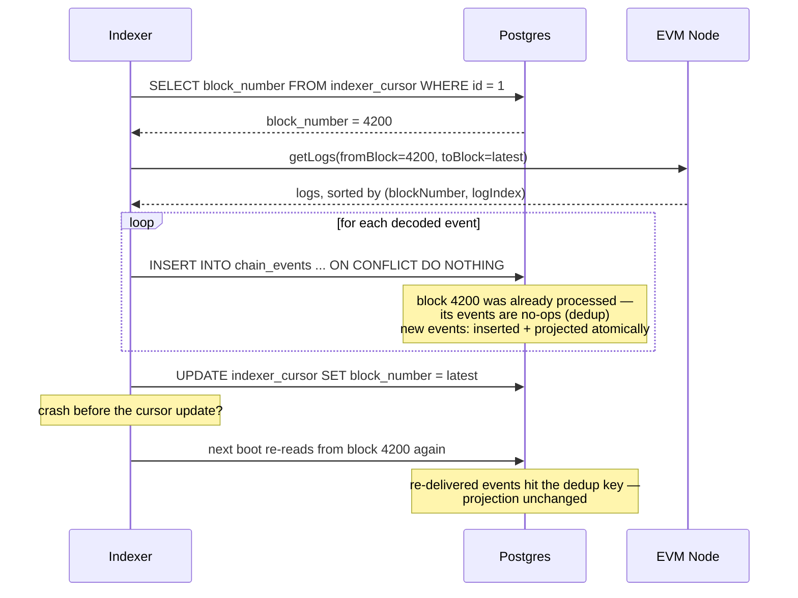

One clarification on reorg handling: if a shallow reorg ever orphans stored events, they remain in `chain_events` with their original `id` — nothing detects or deletes them. They do not corrupt the projection because the projection is driven by what the indexer ingests going forward, not by a re-scan of `chain_events` at a point in time. If full reorg-awareness is needed — rolling back `positions` to a pre-fork snapshot — that requires additional machinery (a shadow table, stored block hashes, or event sourcing from scratch). The current design accepts that `chain_events` may contain a small number of orphaned rows from shallow reorgs and tolerates this because the reconciliation engine's invariant checks will catch any resulting projection inconsistency on the next cycle.

### Why Not Kafka

The natural next question is why the indexer does not publish to a Kafka topic and let downstream consumers (the recon engine, the NAV gate) subscribe independently.

The answer is scale fit. There is one producer (the indexer reading one EVM node) and one consumer of the event stream (the projection into Postgres). Kafka's value proposition is durable, high-throughput fan-out to N independent consumers with independent offset tracking. None of that is needed here. Adding Kafka would mean operating a broker cluster, managing topic configuration, tracking consumer group offsets, and handling broker-side retention separately from Postgres retention. The cursor table in Postgres is already a durable offset store. Postgres's WAL is already a durable write queue. The indexer already provides at-least-once delivery with idempotent inserts on the consumer side.

If the architecture grew to require real-time push to a UI, a risk engine, and an external reporting system — all consuming the same event stream independently — revisiting a broker would be appropriate. At that point the fan-out cost justifies the operational overhead. The right answer here is not "Kafka is always wrong" but "Kafka solves a problem we do not have yet, and adding it now is operational surface with no return."

### Migration System

Schema changes are applied via hand-written, sequentially numbered SQL files in [`../../db/migrations/`](../../db/migrations/). The boot sequence checks which migration files have been applied (tracked in the `applied_migrations` table: `filename` PK, `applied_at`, `checksum`), applies any pending ones in order, and proceeds. The seven files are `0001_init.sql`, `0002_positions_events.sql`, `0003_nav_reserve_recon.sql`, `0004_idempotency.sql`, `0005_indexer_cursor.sql`, `0006_tx_tracking.sql`, and `0007_recon_notify.sql`. The runner records a sha256 checksum per applied file and throws if a previously-applied file's bytes change underneath it — applied migrations are immutable; you add a new numbered file, you never edit an old one. The files themselves are written to be idempotent where possible — `CREATE TABLE IF NOT EXISTS`, `CREATE INDEX IF NOT EXISTS` — so that running the migration runner twice against an up-to-date database is harmless.

There is no ORM migration tool (no Flyway, no Liquibase, no Prisma migrate). The reason is the same as the raw SQL argument above: the schema is the contract between the application and the database, and that contract should be visible as plain SQL that any engineer can read and reason about without framework knowledge. Migration tools tend to generate SQL that is correct but not obviously correct. For a financial ledger, "obviously correct" is the standard.

---

## End-to-end data flow, design decisions, what was cut, build-vs-buy boundaries, production gaps, and verification

### End-to-end data flow

The sequence below traces two complete round-trips through the system: the happy path from investor action through reconciliation to a successful claim, and the failure path where a bad NAV mark halts distribution before any value moves.

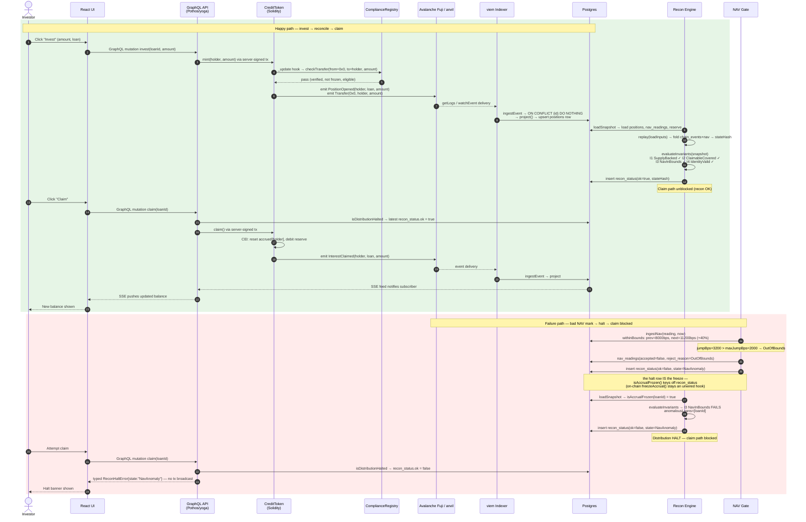

**Reading the diagram.** Steps 1–23 are the happy path. The server-signed GraphQL mutation triggers an on-chain `mint`, which routes synchronously through `ComplianceRegistry.checkTransfer` via CreditToken's OpenZeppelin v5 `_update` hook. If that passes, the tx is mined, the indexer picks up the emitted events, and the reconciliation engine's next cycle runs its four invariant checks. Because all four pass, the `recon_status` table records `ok=true` and the claim path opens. When the investor claims, the API's broadcast gate reads that flag (`isDistributionHalted`) before touching the chain; the contract then applies checks-effects-interactions (accrual reset and reserve debit before any external call), emits `InterestClaimed`, and the SSE feed propagates the balance change to the UI.

Steps 24–34 show the NAV anomaly path. The acceptance gate (`withinBounds` in [`../../api/src/nav/bounds.ts`](../../api/src/nav/bounds.ts)) runs against the last *accepted* mark for the loan — not the last received, which would allow a cascade where each bad mark anchors the next. A +40% jump (4000 bps) against the 2000 bps cap is rejected immediately, stored as `accepted=false` with a typed `OutOfBounds` reason, and written as a `NavAnomaly` halt to `recon_status`. The I3 invariant in the next recon cycle confirms it. Both sides independently block distribution — the NAV gate's write and the invariant evaluation are intentionally redundant so neither is a single point of failure.

---

### Key design decisions

#### (a) ERC-3643-lite, not full ERC-3643

ERC-3643 (the T-REX standard) specifies a complete identity framework: ONCHAINID DIDs, a trusted-issuers registry, claim-topic registries, and ERC-1400 partitions. All of that was considered and most of it was cut. What remains is the structural seam that ERC-3643 gets right: compliance enforcement *inside* the transfer hook, not bolted on top.

The hook chosen is the OpenZeppelin v5 `_update` method on ERC-20. Every mint, burn, and transfer — including internal movements — routes through it. `_update` calls `ComplianceRegistry.checkTransfer`, which runs a six-step gauntlet in fixed precedence order: sender-freeze (`SenderFrozen`), receiver-freeze (`ReceiverFrozen`), receiver-verification (`ReceiverNotVerified`), general eligibility (`NotEligible`), Reg-D accreditation (`AccreditationRequired`), and Reg-S jurisdiction — a US holder under Reg-S reverts `NotEligible`, not a separate error. The first failing check reverts with its typed custom error. Nothing passes silently.

What was dropped: ONCHAINID (a full DID layer that adds deployment complexity without changing the transfer-gate semantics for a demo), the trusted-issuers registry (issuers are seeded by the deploy script, not discovered on-chain), and ERC-1400 (partitions and operator transfer mechanics are out of scope for a single-class token). The omissions are defended, not accidental — the focus is the reconciliation seam, not standards completeness. A production deployment would layer the trusted-issuers registry on top of the same `_update` hook without touching the reconciliation engine.

#### (b) Typed reason codes — the closed-set argument

Every failure in the system has one machine-checkable code. [`../../contracts/src/Errors.sol`](../../contracts/src/Errors.sol) declares six Solidity custom errors (`SenderFrozen`, `ReceiverFrozen`, `ReceiverNotVerified`, `NotEligible`, `AccreditationRequired`, `InsufficientReserve`) and nothing else. [`../../shared/src/reasons.ts`](../../shared/src/reasons.ts) mirrors them as a TypeScript discriminated union, adds two engine-only HALT states (`NavAnomaly`, `ReconMismatch`) that have no on-chain analog, and exports an `assertNever` helper.

The `assertNever` helper exists to prove union closure at compile time. Every `switch` over `DomainError['kind']` that omits a branch fails to compile — the missing arm leaves a type that is assignable to `never`, and `assertNever` accepts only `never`. This is not a runtime safety net; it is a *proof mechanism* that the closed-set property holds across the codebase. A future error code addition forces the compiler to enumerate every switch that needs updating, turning a potential silent regression into a build failure.

Decoding a revert back into a reason code does not rest on hand-maintained selectors. [`../../api/src/chain/errors.ts`](../../api/src/chain/errors.ts) passes raw revert data to viem's `decodeErrorResult` against `COMBINED_ERROR_ABI` — the union of every custom-error fragment across `CreditToken` and both registries, assembled at module load from the same Foundry-emitted artifacts the contracts compiled to — and then maps the decoded error *name* through a closed name→`ReasonCode` record. Binding to the compiled artifacts means a renamed or re-parameterized error stops decoding loudly (falls through to `null`, surfaced as a generic failure) instead of silently mis-mapping. The event side has its own drift test: `indexer/test/abi.consistency.test.ts` asserts the indexer's inline event fragments are field-for-field identical to the compiled artifact's, failing the suite the moment they diverge. (A `SOLIDITY_ERROR_SELECTORS` map still exists in `shared/src/reasons.ts` from an earlier selector-table design; it is empty and unused — the artifact-bound name decode above is the real mechanism.)

#### (c) Deterministic replay and stateHash

Covered in depth in the L3 section, but the end-to-end consequence deserves emphasis here. The `stateHash` written into every `recon_status` row by [`../../api/src/recon/engine.ts`](../../api/src/recon/engine.ts) is produced by a *cold replay* of the full event log and NAV readings from Postgres — not a snapshot fingerprint of current read-model state. This means an auditor can independently run `replay(loadInputs(sql))` and obtain the same hash recorded at any point in the cycle history. The live engine and the cold replay are provably identical by construction, not by assertion.

The canonical ordering in [`../../api/src/replay/fold.ts`](../../api/src/replay/fold.ts) — `(blockNumber, logIndex)` for chain events, `(observedAt, source, navBps)` for NAV — eliminates arrival-order sensitivity. Whatever order events are delivered (WebSocket gap, reorg re-delivery, test permutation), they sort to the same sequence, and the fold produces the same `stateHash`. The hash serialization in [`../../api/src/replay/hash.ts`](../../api/src/replay/hash.ts) normalizes position open-blocks to deployment-stable ordinals, preventing foundry toolchain upgrades (which can repack deploy transactions into different blocks) from silently drifting the golden hash.

#### (d) Hybrid real-chain — Fuji for the demo, anvil for determinism

The indexer and API connect to Avalanche Fuji C-Chain. This keeps the demo live: real transactions, real block times, real RPC. But correctness is *never* asserted against Fuji. The scenario matrix, all property tests, and all invariant tests run against a local anvil node. The reasons are practical: public Fuji RPCs rate-limit, time out, and lag under CI load. A test failure against Fuji could indicate an RPC glitch rather than a logic error, making the signal useless. Against a local node, block production is deterministic, confirmations are instant, and a failure always means the code is wrong.

The indexer is designed for Fuji's unreliability: it stores a resumable cursor, re-ingests idempotently (ON CONFLICT DO NOTHING), and retries with backoff. A dropped connection corrupts nothing — the next reconnect replays from the stored cursor position and the read model converges.

#### (e) Server-signed transactions, seeded identities, no auth

The UI sends an invest or claim intent to the GraphQL API. The API holds the issuer private key and signs the transaction server-side before submitting to Fuji. Identities are seeded by `Deploy.s.sol` — the six wallets (2 US-accredited, 2 Reg-S, 1 unverified, 1 frozen) are baked in at deploy time. There is no login, no session, no per-user wallet in the UI.

This is deliberate demo scope. The system is demonstrating the reconciliation seam, not the custody model. What production replaces each piece with: server signing → per-identity account-abstraction wallets with the issuer key behind an HSM/KMS; seeded identities → a KYC/KYB onboarding flow (a mock version ships as #39, driven by the `submitKyc` mutation) where a provider verdict issues a signed claim to `IdentityRegistry`; no auth → real authn/authz with per-identity wallets tied to authenticated sessions. The production surface is additive; the on-chain logic is unchanged.

#### (f) Raw SQL migrations, no ORM

The database schema lives entirely in [`../../db/migrations/`](../../db/migrations/) as numbered plain SQL files. No ORM, no query builder, no schema-inference layer. The choice is deliberate: SQL migrations are auditable line by line, version-controlled diffs are meaningful, and there is no hidden behavior (no auto-generated indexes, no soft-delete conventions, no magic timestamp columns). For a system whose correctness argument rests on the read model faithfully reflecting on-chain state, hidden ORM behavior is a liability. The tagged-template SQL driver (`postgres.js`) used throughout the API and indexer provides parameterized queries without abstraction overhead.

---

### What was cut

Each item below has a brief production story explaining what would replace it. The cuts are explicit so the boundary between built and deferred is legible.

**Real fiat ramp and real USDC.** The reserve is a `MockUSDC` ERC-20 funded by the deploy script. `claim()` debits this mock reserve; there is no custody rail, no stablecoin settlement, no DvP. Production: a regulated custody/settlement rail holds real USDC; the reserve balance reflects actual servicer collections; a delivery-versus-payment settlement layer ensures token delivery and cash settlement are atomic.

**Account-abstraction onboarding.** Identities are seeded by `Deploy.s.sol`. The KYC onboarding path (#39) — a `KycProvider` interface, a mock implementation, and the `submitKyc` mutation that turns a provider verdict into an issuer-signed `setClaims` call — demonstrates the build-vs-buy integration point, but there are no investor-owned wallets: the addresses are still the seeded six. Production: AA wallets (ERC-4337 or a similar model) give investors non-custodial addresses; a real KYC/KYB provider issues a signed verdict; the issuer countersigns and writes `setClaims` on-chain.

**Secondary market / ATS matching.** There is no order book, no peer-to-peer transfer flow, and no ATS integration. Tokens can be transferred by the issuer but there is no mechanism for investors to trade positions. Production: an ATS engine matches orders and settles transfers through the same `_update` gauntlet — the same compliance checks apply, the same event indexer picks up the `Transfer`, and the same reconciliation engine validates that the new holder composition is clean.

**Multi-tranche securitization.** Each loan is represented by a single `CreditToken` — one class, no waterfall priority. The tranche waterfall is deliberately cut, not built: there is no waterfall engine anywhere in this codebase, on-chain or off. Senior/mezz/junior structuring is the named next asset module (see the build-vs-buy boundaries below). Production: each tranche would be its own `CreditToken` instance, with waterfall priority encoded in a separate distribution contract that calls `claim()` in seniority order and enforces subordination rules.

**Auth and login.** There is no authentication layer anywhere — no session, no JWT, no wallet-based sign-in. The UI uses a fixed demo address. Production: real authn/authz ties session identity to a verified on-chain address; the server-signing key moves behind an HSM/KMS with per-request authorization; the GraphQL API enforces per-identity data access.

**Hard on-chain supply cap.** There is no `maxSupply` variable on `CreditToken`. The issuer can mint any amount. The reconciliation invariant I1 (`SupplyBacked`) catches drift reactively — if minted supply exceeds the backed principal, I1 fails and distribution halts — but there is no proactive cap preventing the over-mint in the first place. Production: a mutable cap keyed to the loan's outstanding principal (sourced from the originator's loan origination system) enforces a hard ceiling, and I1 becomes a belt-and-suspenders check rather than the only guard.

**Residential consumer-law gating.** The `collateralType ∈ {CRE, RESIDENTIAL}` seam lives on the loan data — the deploy manifest and the `loans.collateral_type` column — and the codebase is seeded with 5 CRE loans and 1 residential loan. The `ComplianceRegistry` itself has no collateral awareness today; TILA / RESPA / ability-to-repay checks are named as an extension point on it but not implemented. The gauntlet structure is designed to accommodate them as additional steps without disturbing the existing checks.

**Borrow-against / money market.** Pledging the credit token as collateral to borrow USDC — with LTV ratios, margin calls, and liquidation — is deferred explicitly. This module depends on NAV and reconciliation integrity being proven in production before it is built. A money-market sitting on top of an unproven backing model amplifies any valuation error into a liquidation cascade; the dependency is intentional, not a scheduling convenience.

---

### Build vs. buy — integration boundaries

The cuts above are one half of a larger scoping decision. The other half is the seam the system is built around: one compliant-securities core, built once, with asset-specific modules on top. Get the seam right and adding non-conforming residential, a fund leg, or a third originator is cheap; get it wrong and you maintain N platforms.

#### The seam

Everything splits into two layers:

| Layer | What it is | Built how |
|---|---|---|
| **Shared core** (build once) | KYC / identity · the compliance gauntlet (Reg D/S) · custody / signer · cap-table / indexer · USDC distribution + SSE · the reconciliation gate | Reused by every asset. The expensive, regulated part. |
| **Asset module** (per asset) | origination · servicing · the cash-flow waterfall | Swapped per asset class. The only genuinely new code per leg. |

The single-loan credit flow is the one-tranche degenerate case of a waterfall; a fund or venture leg is the same shape with carry parameters. Same core, different module.

#### Module status

| Module | Status | Note |
|---|---|---|
| CRE single-loan | **built** | the origination path, exercised end to end by the scenario matrix |
| Residential | **built** | same rails; `collateralType` flips; consumer-law gating (TILA/RESPA) is a named extension point, not built |
| Tranche waterfall | **cut — not built** | the token stays single-class; no waterfall model exists in this codebase; this is the named next asset module |
| Borrow-against | **deferred** | the money-market module (pledge token → borrow USDC → LTV/liquidation); depends on NAV/reconciliation integrity being proven first |
| Venture / fund | **deferred** | fund-shaped; the same waterfall concept with fund-carry parameters |

#### Build-vs-buy decision log

What earns a place in this codebase versus what gets integrated:

| Capability | Decision | Why |
|---|---|---|
| KYC / document verification | **Buy** (Persona / Parallel Markets class) | Regulated commodity. Here: a `KycProvider` interface + a mock implementation — swapping in a real provider is a one-file change. The part worth building is the verdict → on-chain claim path. |
| Custody / key management | **Buy** (Fireblocks-class MPC + policy) | Solved, regulated. Don't roll your own keys. |
| Permissioned token standard | **Adopt** (ERC-3643 / T-REX pattern) | Audited institutional standard; don't reinvent transfer compliance. |
| Secondary venue | **Buy / reuse** (a licensed ATS) | A licensed BD + ATS + transfer agent is years of work — reuse one. |
| The reconciliation gate | **Build** | The part this system exists to prove: that the on-chain claim stays backed, and that distribution halts when that can't be shown. |
| The waterfall / cash-flow engine | **Build, later** | The shared primitive across tranches, fund carry, and venture — parameterize once. Deliberately cut from this codebase; first in line when a second asset shape lands. |
| The borrow-against vault | **Build, deferred** | The oracle/LTV/liquidation surface is where the new engineering would concentrate. |

The principle: buy the commodity, build the differentiator. Here the differentiator is the compliant-distribution + integrity stack, not the token mechanics.

Two boundaries belong in this log that the cut list above does not cover: **multi-tenancy** (the shared core is asset-agnostic and could serve a second originator conceptually, but tenant isolation is not built) and a **fee / billing engine** (nothing in the system meters usage; there is no billing surface at all).

#### Integrating with an existing platform

If this design had to merge with an existing securities platform rather than stand alone, the layer table above is the migration map:

1. **Map the seams.** Inventory the existing system against the two layers; tag every piece *keep / cut / re-platform*. Reuse the licensed venue (cap-table + ATS), KYC/compliance vendor, custody, and cash rails; keep the origination, servicing, and asset-module logic. The deliverable is a keep-vs-cut decision log like the one above.
2. **ACL + first slice.** Put an anti-corruption layer between the two holder/position models; migrate one deal; stand up the reconciliation harness comparing both ledgers.
3. **Prove parity, then peel.** Run in parallel until reconciliation shows zero divergence; cut over; retire the duplicated KYC/token/indexer pieces, keeping only the asset module.

No big-bang rewrite — strangler-fig behind an anti-corruption layer, reconciliation-gated at every step. The same gate that polices solvency in steady state is the instrument that proves a migration didn't lose anything.

---

### Production gaps (priority ordered)

The following gaps exist in the current codebase and represent the highest-priority items before a production deployment:

1. **No static analysis in CI.** Neither Slither nor Mythril runs against the contracts on any CI branch. The Foundry fuzz and invariant suites provide meaningful coverage, but static analysis catches whole classes of issues (integer overflow paths, reentrancy patterns, unchecked return values) that fuzz seeds may not reach. This is the highest-priority gap because it is entirely additive — it does not require changing any existing code.

2. **Mock reserve, not a real custody/settlement rail.** `MockUSDC` means the reserve balance is an unconstrained number set by the deploy script. There is no external counterparty, no settlement finality, and no reconciliation against a bank custodian. Until this is replaced with a real custody integration, the reserve figures the reconciliation engine validates are internally consistent but externally unanchored.

3. **Single server signer, no HSM/KMS.** The issuer private key is an environment variable on the API process. A key compromise means an attacker can mint arbitrary supply. In production, the issuer key must live in an HSM or KMS with audited access logs and per-transaction authorization policies.

4. **NAV feed is a seeded source, not a real oracle adapter.** The NAV readings that drive the bounds gate are injected by the test harness and the scenario scripts. There is no adapter for a live valuation source (appraisal vendor, servicer API, price oracle). Until there is, the bounds gate validates internal consistency but not external accuracy.

---

### Verification

The system ships three verification surfaces. All three must be green on the local node before any change is considered done.

**`forge test -vv`** runs the complete Foundry suite: unit tests for each compliance scenario, fuzz tests over the accrual math (`CreditTokenFuzz.t.sol` — accrual is monotonic in elapsed time, a frozen loan accrues nothing further, a claim never pays more than settled accrued), and the stateful invariant suite (`CreditTokenInvariant.t.sol`) driving adversarial mint/warp/claim/fund orderings against two invariants: aggregate holder claimable never exceeds the reserve balance (the on-chain half of I2), and total ever claimed never exceeds total ever funded into the reserve. The reentrancy surface on `claim()` — which applies CEI before any external call — is covered by the same invariant harness. The NAV bounds property (no out-of-bounds or non-monotonic mark is ever admitted to the accepted feed) is *not* a forge fuzz — the gate is off-chain code, and the property lives in the Vitest suite (`api/test/nav.bounds.prop.test.ts`).

**`bun run test`** runs the full Vitest + fast-check suite covering the off-chain layers. Key property tests: the deterministic-replay property (any permutation of the same `ReplayInput[]` produces an identical `stateHash`), the invariant property tests (snapshot configurations that violate each of I1–I4 are correctly detected), and unit tests for `withinBounds`, `ingestEvent` idempotency, and the `assertNever` exhaustiveness helper.

**`bun run scripts/verify_matrix.ts`** drives all 10 scenario rows and the order-independence property against the local node. Each row runs against its own fresh fixture (isolated read model + chain snapshot) so sticky HALT state from one row does not bleed into another — that isolation is the precondition for the order-independence property, which asserts that running the 10 scenarios in any permutation produces the same per-row verdict. The script exits 0 only when all 10 rows pass; CI treats a non-zero exit as a hard failure. See [`../../scripts/verify_matrix.ts`](../../scripts/verify_matrix.ts) for the harness implementation.

---

See [DEMO.md](../DEMO.md) for the guided walkthrough of all 10 scenarios against the live stack, and [README.md](../../README.md) for the 60-second quickstart and the full scenario matrix reference.
