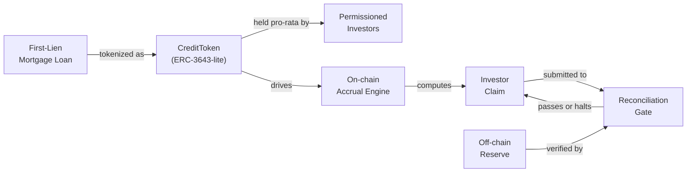
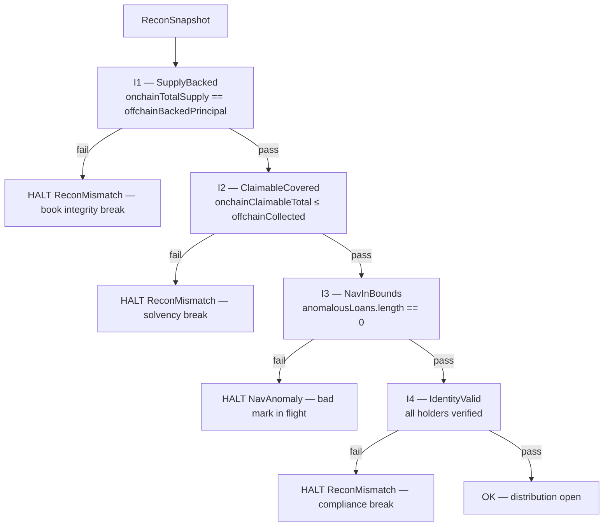

<!-- Design decisions + architecture overview -->

# Design

## What this is

This system tokenizes a first-lien mortgage loan as a permissioned security token on Avalanche, models the loan's ongoing cash flows as on-chain accruals, and runs a continuous off-chain reconciliation engine that proves the token remains fully backed before any distribution is permitted. Investors hold pro-rata claims denominated in the token ([`CreditToken.sol`](../../contracts/src/CreditToken.sol)); an identity layer ([`IdentityRegistry.sol`](../../contracts/src/IdentityRegistry.sol)) records a single `verified` claim per address and the token's `_update` hook enforces that only verified receivers can hold the token, so it behaves as a regulated security rather than a freely tradable asset; and the reconciliation engine ([`api/src/recon/engine.ts`](../../api/src/recon/engine.ts)) acts as a circuit-breaker that halts distributions the moment the off-chain reserve falls out of step with on-chain obligations.

> **The core idea: reconciliation is a gate, not a report.**
>
> Most tokenized-RWA systems treat reconciliation as a periodic audit artifact — something produced for regulators after the fact. This system treats it as a precondition. No distribution clears without a passing reconciliation proof. The gate cannot be bypassed; it is architectural, not procedural.

### The two-ledger problem

A mortgage loan exists in two worlds that do not tick at the same rate. On-chain, accrual runs on a deterministic schedule — balance × `ratePerSecond` × elapsed — and the contract's view of what investors are owed is always current and precise. Off-chain, cash arrives on its own messy timetable: a borrower pays late, a servicer batches wires, a NAV mark moves because an appraiser updated a comparable. None of that touches the chain until a pipeline explicitly writes it there.

The gap between what the token says investors are owed and what the reserve actually holds is *drift*. Unchecked drift is how tokenized-RWA systems silently become insolvent: the token keeps accruing obligations it cannot honor, distributions go out under-backed, and the shortfall surfaces only when a redemption can't be satisfied. The conventional mitigation — monthly reconciliation plus a NAV restatement — has two fatal weaknesses in a tokenized context: the window between reconciliations is a window of unknown exposure, and a restatement after the fact does not un-send a distribution that went out on bad numbers. This system closes both gaps: reconciliation runs continuously, and distribution is gated on a passing proof rather than on a calendar.

### High-level overview



The loan is the root of trust; token supply, accrual schedule, and investor entitlements are all derived from its terms. The gate is where the off-chain world re-enters the on-chain world — the only path through which a claim becomes a distribution, and it will not open unless the reserve proof is current and valid.

### Three-layer model

**L1 — Permissioned token.** [`CreditToken`](../../contracts/src/CreditToken.sol) is a transfer-restricted ERC-20 whose movement is conditioned on the [`IdentityRegistry`](../../contracts/src/IdentityRegistry.sol): no transfer or mint executes unless the receiver holds a valid `verified` claim. The token layer holds balances, enforces the verified-receiver rule, and runs per-holder accrual bookkeeping. It has no awareness of NAV, reserves, or reconciliation.

**L2 — Accrual and NAV.** Accrual is on-chain: `CreditToken` settles per-holder interest lazily and exposes `claimable()`. This layer's off-chain job is to independently re-derive and police that number — ingesting events through the indexer, replaying the full event history into a deterministic state machine, and computing the acceptable NAV/reserve envelope.

**L3 — Reconciliation engine.** The engine ([`api/src/recon/engine.ts`](../../api/src/recon/engine.ts)) continuously evaluates the invariants that must hold for solvency: supply is backed, reserve covers claimable, NAV is in bounds, every holder is verified. Any failure closes the gate and keeps it closed until the condition is resolved and re-evaluated. A failed invariant is a hard stop, not a warning.

---

## Layer 1 — Permissioned token

[`IdentityRegistry`](../../contracts/src/IdentityRegistry.sol) is the on-chain source of truth for eligibility: a single `verified` boolean per address, stored in a `mapping` (a first-class storage slot the `_update` hook can read O(1) and atomically, not a log it would have to re-derive). `ClaimsUpdated` is still emitted as an audit trail, but the authoritative state the permissioning check reads is always the mapping. Writes are issuer-gated (`onlyRole(ISSUER_ROLE)`) — a narrow, controllable gate, not self-service registration.

**The permissioning check lives in `_update`.** [`CreditToken._update`](../../contracts/src/CreditToken.sol) overrides the OpenZeppelin v5 hook that fires on *every* balance-changing operation — `mint`, `transfer`, `transferFrom`, `burn`. Putting the check here rather than on the public `transfer` means it cannot be routed around via `approve` + `transferFrom`:

```solidity
function _update(address from, address to, uint256 amount) internal override {
    if (to != address(0) && !identity.isVerified(to)) {
        revert ReceiverNotVerified(to);
    }
    if (from != address(0)) _settleAccrual(from);
    if (to != address(0)) _settleAccrual(to);
    super._update(from, to, amount);
}
```

The verified-receiver check runs before `super._update`, so a reverting check never mutates balances. Burns skip it (`to == address(0)`) so issuer clawback — a regulatory requirement — always works.

**Typed reason codes, not strings.** [`Errors.sol`](../../contracts/src/Errors.sol) declares three Solidity custom errors (`ReceiverNotVerified`, `InsufficientReserve`, `ExceedsPrincipal`); [`shared/src/reasons.ts`](../../shared/src/reasons.ts) mirrors them as a TS discriminated union and adds two engine-only HALT states (`NavAnomaly`, `ReconMismatch`). An `assertNever` helper makes any `switch` that omits a branch a *compile* error — the closed set is enforced at the type level on both sides of the chain boundary. Decoding a revert binds to the Foundry-emitted artifacts (viem's `decodeErrorResult` over the combined error ABI), so a renamed error stops decoding loudly instead of silently mis-mapping.

This is "ERC-3643-lite": the structural seam ERC-3643 gets right (compliance enforced *inside* the transfer hook) without ONCHAINID, a trusted-issuers registry, or ERC-1400 partitions. The earlier multi-step gauntlet — jurisdiction, accreditation, per-identity freeze, Reg-D/Reg-S eligibility — was collapsed out, leaving the verified-receiver predicate. The omissions are defended, not accidental; the focus is the reconciliation seam, not standards completeness.

---

## Layer 2 — Accrual and NAV

**Accrual is lazy and linear.** Interest accrues as balance × `ratePerSecond` × elapsed seconds — no compounding, no scheduled job, no per-holder write until a balance change or `claim()` forces settlement. `_settleAccrual` folds elapsed time into `accrued`; the read-only `claimable(address)` previews the pending slice without a transaction. A `haltedElapsed` counter subtracts time spent in a DEFAULT or NAV-frozen state without iterating over holders, so a halt preserves everyone's pre-halt earnings exactly.

**`claim()` is checks-effects-interactions.** It checks `owed ≤ reserve balance` (else reverts `InsufficientReserve`), zeroes `accrued` *before* the external transfer, then transfers — with a `nonReentrant` guard as belt-and-suspenders. There is no window in which `accrued` is nonzero and the transfer has already happened.

**The NAV acceptance gate.** A NAV mark is the servicer's periodic valuation in basis points of par. The platform does not trust marks blindly — `withinBounds` ([`api/src/nav/bounds.ts`](../../api/src/nav/bounds.ts)) is a *pure* function (the clock `now` is injected, so replay can re-derive every decision) that checks four conditions in a fixed order: `UnknownLoan`, `Stale` (older than `maxStalenessSec`), `NonMonotonicTimestamp` (not newer than the last *accepted* mark — comparing against last-accepted, not last-received, defeats a good/bad-mark cascade), and `OutOfBounds` (jump exceeds `maxJumpBps`, default ±20%). A +40% jump is rejected as `OutOfBounds`.

**What a `NavAnomaly` freezes.** On rejection, [`api/src/nav/gate.ts`](../../api/src/nav/gate.ts) writes the rejected reading (`accepted = false`) and a halt row into `recon_status` (`state = 'NavAnomaly'`). **That halt row *is* the freeze:** everything that advances or evaluates accrual keys off `recon_status`, so the freeze is in force the instant the row commits, and every distribution path is blocked. The contract has a matching `freezeAccrual()` hook, but it is currently unwired — a named, ready extension point, exercised only by the Solidity tests. Stated plainly as a production gap: until the gate submits an issuer-signed `freezeAccrual`, on-chain `claimable()` keeps growing through a halt, and only the off-chain halt prevents that growth from ever paying out. The freeze is sticky by design — a NAV anomaly is an integrity signal requiring operator review, not a transient condition that clears on the next good mark.

The NAV bound is a single exported constant that both the gate and the replay path import. If the two sides used different bounds they would disagree about which marks are valid, and I3 (`NavInBounds`) would fire as a spurious halt. One constant is the only defense.

---

## Layer 3 — Reconciliation engine and deterministic replay

**Why not just call `balanceOf()`?** Three reasons. (1) `balanceOf` returns token count, not accrued-but-unclaimed interest — you need the event history to reconstruct claimable. (2) Even with claimable, you can't prove solvency from on-chain state alone: the chain knows what holders are owed, not whether the servicer actually collected that cash. (3) There is no canonical history in the ERC-20 state root — detecting a double-credit or a bad accrual reset requires replaying the log. The engine treats the event log as the primary source of truth and materializes claimable state from scratch every cycle.

**The replay fold and `stateHash`.** [`api/src/replay/fold.ts`](../../api/src/replay/fold.ts) reduces an unordered set of chain events + NAV readings into a `ReplayState`. It is a *pure* function — no I/O, no wall-clock; the clock `now` is derived from the inputs (max NAV `observedAt`). Chain events fold in `(blockNumber, logIndex)` order, NAV in `(observedAt, source, navBps)`; any input set has exactly one canonical fold order, and clone-on-write makes the fold safe to run speculatively. The state is fingerprinted by a `keccak256` over a canonicalized serialization ([`api/src/replay/hash.ts`](../../api/src/replay/hash.ts)) that fixes JSON key order, sorts Map entries, stringifies BigInts, and normalizes position open-blocks to deployment-stable ordinals (so a Foundry repack can't drift the golden hash).

**Interleaving-independence is the headline property.** The indexer is async and resumable — events can arrive out of order across reconnects, restarts, or reorgs. The property test ([`api/test/replay.interleaving.prop.test.ts`](../../api/test/replay.interleaving.prop.test.ts)) generates arbitrary input pools with fast-check and asserts every permutation produces an identical `stateHash` — pure, ≥256 cases, no flake. Idempotency is keyed on `txHash:logIndex` (not `blockNumber:logIndex`, which would double-ingest a re-mined tx after a reorg); the ordering key `(blockNumber, logIndex)` is deliberately separate from the dedup key. The engine does a **full replay from genesis every cycle** — at this scale it costs under a millisecond, and it sidesteps the snapshot-correctness problem that incremental replay would reintroduce.

**The four invariants** are evaluated in a fixed order, short-circuiting on the first failure (so the recorded `failed_invariant` is deterministic):



I1 and I2 protect against different failure classes. **I1 (SupplyBacked)** asks whether on-chain supply matches the off-chain book — a drift means a projection/ABI bug, not a cash problem. **I2 (ClaimableCovered)** asks whether the reserve can actually pay what's owed (`claimable ≤ collected`, a `≤` not `=` because over-collection is fine) — a failure means a servicer action or a halt until cash arrives. Matrix row 7 trips I2 by reporting collected cash one unit below aggregate claimable.

**Fail-closed: HALT beats best-effort.** Every value-moving mutation routes through `broadcastGated` ([`api/src/resolvers/mutations.ts`](../../api/src/resolvers/mutations.ts)), which reads the latest persisted `recon_status` and throws a typed `ReconHaltError` before any chain interaction if `ok = false` — no partial payments, no degraded mode. The reasoning is asymmetric: **overpaying is unrecoverable** (USDC has left the reserve), while **refusing to pay is always recoverable** (holders wait; fix the violation and re-run). A HALT is also loud — it blocks every downstream action, forcing the root cause to be addressed instead of degrading silently.

---

## Persistence

One Postgres database, hand-written SQL, no ORM, no broker. The two hot paths (the recon engine and the NAV gate) read exactly the columns they name, so query cost is visible in source and a framework upgrade can't silently change the access path — and when an invariant flags a mismatch, you trace it through readable SQL. The schema is twelve tables; the load-bearing patterns:

- **Idempotency via EventId.** `chain_events` rows are keyed `txHash:logIndex` with `INSERT … ON CONFLICT (id) DO NOTHING`. A log is globally unique by `(txHash, logIndex)`, so re-ingesting a block after a crash, restart, or reorg is structurally a no-op.
- **Cursor safe-behind.** `indexer_cursor` advances *after* each event commits, never in the same transaction — a crash leaves the cursor behind (re-reading no-op events), never ahead (skipping). There is no reorg detection: if a reorg drops an already-projected tx, the divergence is exactly what the reconciliation invariants catch next cycle. The backstop is the engine, not the cursor.
- **Global verdicts.** `recon_status` has no `loan_id` — a cycle is one verdict over the whole ledger. Rows are immutable; an `AFTER INSERT` trigger `pg_notify`s the SSE feed so a HALT reaches the UI the moment it commits.
- **`reserve` + `reserve_ledger`.** A single-row `reserve` balance plus an append-only `reserve_ledger` of credits/debits — the audit trail behind the balance. `tx_status` separately tracks pending writes (`PENDING` → `CONFIRMED`/`REVERTED`); canonical `positions` are the indexer's projection.

Not Kafka: one producer, one consumer of the event stream — Kafka's fan-out value isn't needed, and the cursor table is already a durable offset store. Migrations are numbered, checksummed, immutable SQL files (no Flyway/Prisma) so the schema contract is plain readable SQL.

---

## What was cut

Each cut is explicit, with the production story that would replace it:

- **Real fiat ramp / USDC** — the reserve is `MockUSDC`; production needs a regulated custody/settlement rail with DvP.
- **Account-abstraction onboarding** — identities are seeded; the KYC module (#39, mock `KycProvider` → issuer-signed claim) demonstrates the integration point, but there are no investor-owned wallets yet.
- **Secondary market / ATS matching** — no order book; production routes matched trades through the same `_update` check and the same reconciliation engine.
- **Multi-tranche securitization** — single-class token, no waterfall model anywhere in the codebase; the named next asset module.
- **Auth / login** — none; the UI uses a fixed demo address.
- **Hard on-chain supply cap** — `mint` is issuer-bounded by the loan's `principalCap` (`ExceedsPrincipal`), but per-offering cap-table logic is a named extension point.
- **Residential consumer-law gating** — the `collateralType ∈ {CRE, RESIDENTIAL}` seam lives on the loan data (5 CRE + 1 residential seeded); TILA/RESPA/ability-to-repay are a named extension point on `_update`, not built.
- **Borrow-against / money market** — deferred *deliberately*: a money-market on an unproven backing model amplifies any valuation error into a liquidation cascade, so it depends on NAV/reconciliation integrity being proven first.

---

## Build vs. buy — integration boundaries

The scoping decision the system is built around: one compliant-securities core, built once, with asset-specific modules on top. Get the seam right and adding residential, a fund leg, or a third originator is cheap; get it wrong and you maintain N platforms.

| Layer | What it is | Built how |
|---|---|---|
| **Shared core** (build once) | KYC/identity · the verified-receiver check · custody/signer · cap-table/indexer · USDC distribution + SSE · the reconciliation gate | Reused by every asset. The expensive, regulated part. |
| **Asset module** (per asset) | origination · servicing · the cash-flow waterfall | Swapped per asset class. The only genuinely new code per leg. |

The single-loan credit flow is the one-tranche degenerate case of a waterfall; a fund leg is the same shape with carry parameters. Same core, different module.

| Capability | Decision | Why |
|---|---|---|
| KYC / document verification | **Buy** (Persona / Parallel Markets class) | Regulated commodity. Build only the verdict → on-chain-claim path. |
| Custody / key management | **Buy** (Fireblocks-class MPC) | Solved, regulated. Don't roll your own keys. |
| Permissioned token standard | **Adopt** (ERC-3643 / T-REX) | Audited institutional standard; don't reinvent transfer compliance. |
| Secondary venue | **Buy / reuse** (a licensed ATS) | A licensed BD + ATS + transfer agent is years of work. |
| The reconciliation gate | **Build** | The differentiator — the part this system exists to prove. |
| The waterfall / cash-flow engine | **Build, later** | Shared primitive across tranches/fund/venture; parameterize once. |
| The borrow-against vault | **Build, deferred** | Where the oracle/LTV/liquidation engineering concentrates. |

The principle: buy the commodity, build the differentiator. Here the differentiator is the compliant-distribution + integrity stack, not the token mechanics. If this had to merge with an existing securities platform, the layer table is the migration map: put an anti-corruption layer between the holder/position models, migrate one deal, run both ledgers in parallel until reconciliation shows zero divergence, then peel. The same gate that polices solvency is the instrument that proves a migration didn't lose anything — strangler-fig, reconciliation-gated at every step.

---

## Production gaps (priority ordered)

1. **No static analysis in CI.** Neither Slither nor Mythril runs against the contracts. Highest priority because it is entirely additive — no existing code changes.
2. **Mock reserve, not a real custody/settlement rail.** `MockUSDC` means reserve figures are internally consistent but externally unanchored.
3. **Single server signer, no HSM/KMS.** The issuer key is an env var on the API process; production needs an HSM/KMS with per-transaction authorization.
4. **NAV feed is a seeded source, not a real oracle adapter.** Marks are injected by the harness; there is no adapter for a live valuation source yet.

---

## Verification

Three surfaces, all green on the local node before any change is done:

- **`forge test -vv`** — Foundry unit + fuzz (`CreditTokenFuzz` — accrual monotonic, frozen loan accrues nothing, claim never exceeds settled accrued) + stateful invariant suite (`CreditTokenInvariant` — claimable never exceeds reserve; total claimed never exceeds total funded; reentrancy on `claim` covered by the same harness).
- **`bun run test`** — Vitest + fast-check over the off-chain layers: the deterministic-replay property (any permutation → identical `stateHash`), per-invariant detection tests, and unit tests for `withinBounds`, ingest idempotency, and `assertNever`.
- **`bun run scripts/verify_matrix.ts`** — drives all 7 scenario rows plus the order-independence property against the local node, each row on its own fresh fixture so sticky HALT state can't bleed across rows. Exits 0 only when all 7 pass.

---

See [DEMO.md](../DEMO.md) for the guided walkthrough and [README.md](../../README.md) for the 60-second quickstart and the scenario matrix.
