# System Map — classes, modules, and entities

A whiteboard-ready reference: how the major pieces interrelate, in five views.

1. [System component graph](#1-system-component-graph) — the 30,000-ft topology
2. [On-chain class diagram](#2-on-chain-class-diagram-l1--l2) — the Solidity contracts
3. [Off-chain module dependency graph](#3-off-chain-module-dependency-graph) — the TS packages
4. [Entity-relationship diagram](#4-entity-relationship-diagram-postgres) — the Postgres read models
5. [End-to-end data flow](#5-end-to-end-data-flow) — invest → accrue → reconcile → halt

> All diagrams are Mermaid; they render inline in the WebStorm/GitHub preview pane.

---

## 1. System component graph

The four runtimes and what crosses between them. The **reconciliation engine** is the load-bearing piece: it folds the chain event log back into expected state and gates distribution.

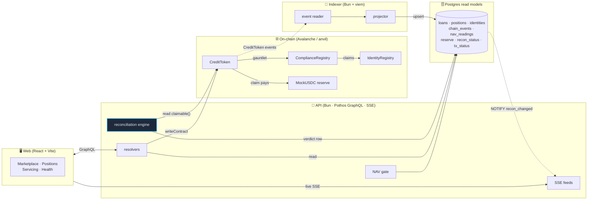

---

## 2. On-chain class diagram (L1 + L2)

ERC-3643-lite: every transfer routes through `_update` → the compliance gauntlet → identity claims. Reverts are **typed custom errors**, never strings.

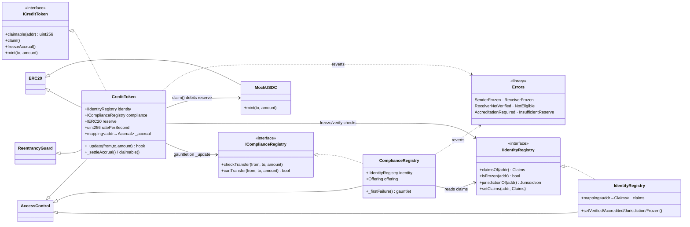

**The gauntlet (fixed order, first failure reverts):**

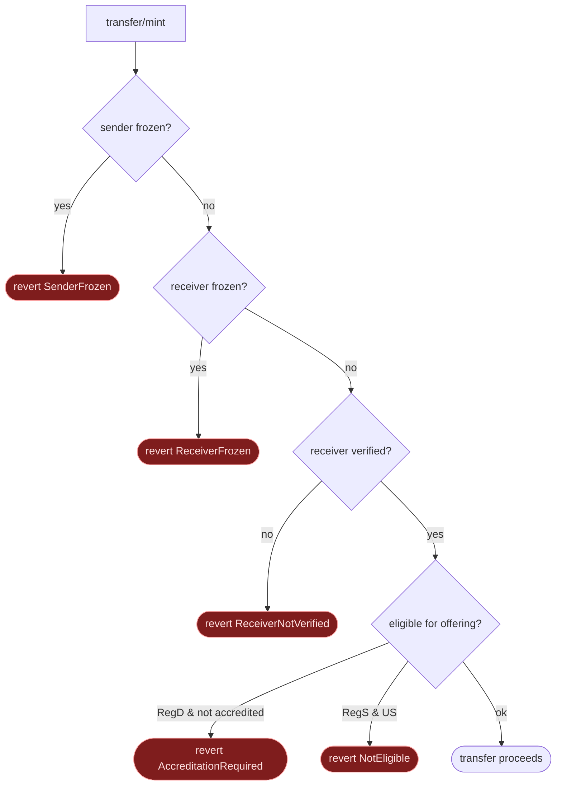

---

## 3. Off-chain module dependency graph

Arrows point **toward the dependency** (A → B means "A imports/uses B"). `@pcl/shared` (brand · reasons · schemas · db) is the common vocabulary every package builds on.

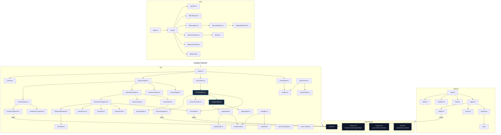

---

## 4. Entity-relationship diagram (Postgres)

Eleven read-model tables (plus `applied_migrations`). `properties → loans → positions` is the asset spine; `tx_status → optimistic_positions` is the pending-write overlay; `recon_status`, `reserve`, `indexer_cursor` are singletons/append-only ledgers.

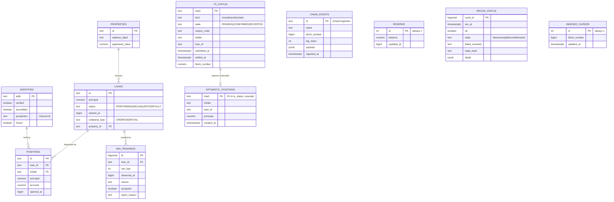

> `chain_events`, `recon_status`, `indexer_cursor` carry no FK edges by design — they're the append-only event log, the verdict ledger, and the resume cursor. `chain_events.id = txHash:logIndex` is the idempotency key; `(block_number, log_index)` is the separate replay-ordering key.

---

## 5. End-to-end data flow

One invest, one accrual tick, one reconciliation cycle, and a halt — the whole heartbeat in one sequence.

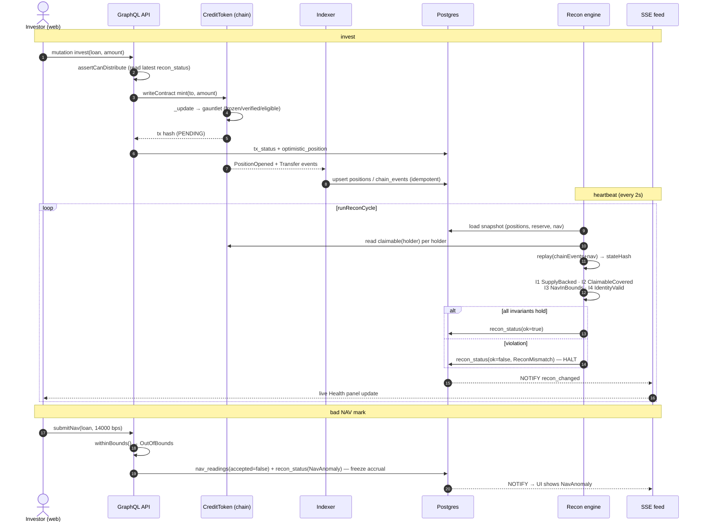

---

### How to read these together

- **Diagram 2** is what the chain enforces (the "can't lie" layer).
- **Diagram 3** is what recomputes and checks it off-chain (the "prove it" layer).
- **Diagram 4** is where the recomputed truth lands.
- **Diagram 5** is the loop that ties them — and the two ways it halts.

The single most important edge in the whole system: **Recon engine → `read claimable()` on CreditToken**, compared against **`reserve.balance` in Postgres**. That comparison is invariant **I2 ClaimableCovered** — the solvency gate. Everything else exists to make that comparison trustworthy and reproducible.

---

# Part II — Deep dives

The five views above are the map. The seven below are the territory: each takes one mechanism and explains it at the depth you'd need to defend it at a whiteboard. Order roughly follows the data: reconcile → replay → halt → accrue → gate → settle the pending write → feed it back.

## 6. The reconciliation cycle (the heartbeat, internally)

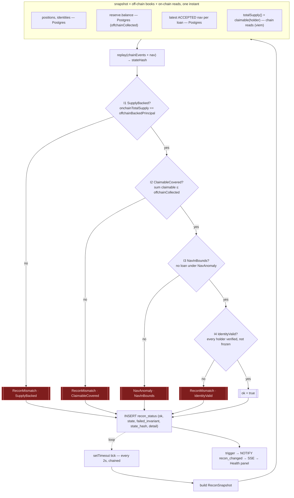

**What a "cycle" actually is.** Every 2 seconds `startReconDriver` fires `runReconCycle`. The cycle is stateless between runs — it holds nothing in memory, re-derives everything from Postgres + the chain, writes exactly one `recon_status` row, and returns. That statelessness is deliberate: a crash, a restart, or a parallel reader all see the same answer because the answer is a pure function of durable state. There is no "accumulator" that could desync.

**The snapshot is the whole trick.** Notice the snapshot straddles the seam — it reads the off-chain books (`positions`, `reserve`, `identities`, the latest *accepted* NAV) from Postgres *and* the on-chain truth (`totalSupply()`, `claimable(holder)`) directly from the contract via viem. The invariants then compare one side against the other. This is why the engine can catch a divergence the indexer alone never could: the indexer only knows what it projected; the recon engine asks the chain itself and checks the projection against it.

**The four invariants, in fixed order, short-circuiting on the first failure:**

- **I1 `SupplyBacked`** — `onchainTotalSupply == offchainBackedPrincipal`. Sum of every token's `totalSupply()` must equal the sum of `positions.principal` in the book. If they disagree, the projection is wrong — the book thinks a different number of tokens exist than actually do. This is an *integrity* break (the ledger is miscounting) — typically the indexer's projection drifting from the chain.
- **I2 `ClaimableCovered`** — `sum(claimable(holder)) ≤ offchainCollected`. Aggregate on-chain claimable must be covered by the cash the servicer actually collected (the reserve balance). This is the *solvency* gate — the single most important comparison in the system. If it breaks, holders could claim money that was never collected. Matrix row 10 breaks it on purpose by reporting collected cash below claimable (`reportCash`).
- **I3 `NavInBounds`** — no active loan is sitting under a `NavAnomaly` halt. This is the one invariant whose engine `state` is `NavAnomaly` rather than `ReconMismatch`, because its cause is a bad mark, not a cash/supply divergence.
- **I4 `IdentityValid`** — every current holder is verified and not frozen. A frozen or unverified holder on the book is a compliance break the gauntlet should never have permitted; finding one means something bypassed the front door.

**Why fixed order matters.** `evaluateInvariants` returns the *first* failure. If the order were nondeterministic, the recorded `failed_invariant` could flip between runs on a state that breaks two invariants at once — and matrix row 10 would flake in CI. Determinism of the *verdict*, not just the *value*, is the property.

## 7. Deterministic replay and the `stateHash`

```mermaid
flowchart LR
  subgraph IN["input SET — any arrival / interleaving"]
    direction TB
    E1["Transfer b=12 li=0"]
    E2["PositionOpened b=12 li=1"]
    E3["NAV observed=1000 src=oracle"]
    E4["InterestClaimed b=20 li=3"]
  end
  IN --> SORT["sort by orderKey()<br/>chain → '0:block:logIndex'<br/>nav → '1:observedAt:source:bps'"]
  SORT --> FOLD["reduce(applyInput, genesis, now)<br/>now = max(observedAt), injected once"]
  FOLD --> ST["ReplayState<br/>positions · reserve · navByLoan · halted"]
  ST --> CANON["canonicalize (sort holders, stringify bigints)"]
  CANON --> HASH["keccak256 → stateHash 0x…"]

  classDef key fill:#1e293b,stroke:#38bdf8,color:#e2e8f0;
  class HASH key;
```

**The property, stated precisely:** for any set of chain events + NAV marks, replaying them in *any* arrival order produces an *identical* `stateHash`. This is the headline fast-check property test, and it's what makes the halt auditable — anyone can re-run the log and get byte-for-byte the same answer.

**How the order-independence is achieved.** The input set is sorted by `orderKey()` *before* folding, so arrival order is irrelevant — every permutation collapses to one canonical order. The key cleverly separates two keyspaces with a tag prefix: chain events sort as `0:blockNumber:logIndex` (zero-padded so string compare == numeric compare), NAV marks as `1:observedAt:source:bps`. The `0:`/`1:` prefix guarantees chain events always precede NAV at the same numeric position, deterministically, with no ambiguity.

**Why `applyInput` must be pure.** The reducer takes state in and returns new state out, clone-on-write, with **no wall clock and no RNG**. The deterministic `now` (the max `observedAt` across the whole input set) is *injected* and threaded identically into every fold. A stray `Date.now()` inside the fold would break the property only under interleaving, only in CI — the nastiest kind of bug. The comment in `fold.ts` flags exactly this.

**Why full replay, not incremental.** Each cycle replays from genesis rather than applying a delta to last cycle's state. That's "wasteful" in the way a pure function is wasteful — and it buys total absence of accumulator drift. There's no incremental state that could desync from the log; the log *is* the state. An incremental fold would reintroduce exactly the class of bug the whole system exists to prevent.

**Why the replay reuses live code.** `applyChain` mirrors the indexer's `project.ts` balance model and `applyNav` calls the *same* `withinBounds` the live NAV gate uses. Replay and live therefore can't diverge — if they used different math, the hash would prove nothing. The single source of truth for "what a Transfer does to balances" is shared between the projector and the replay fold by construction.

## 8. The two HALT mechanisms (and the cascade landmine)

The system fails closed in two distinct places. Knowing which catches what is a classic whiteboard probe.

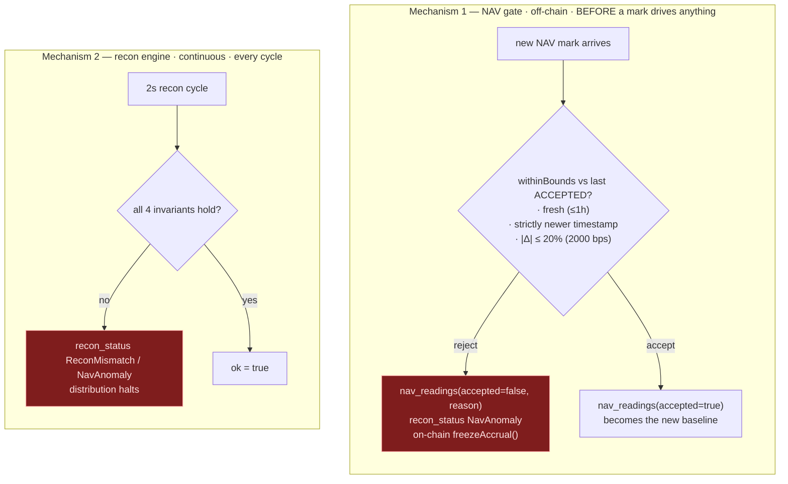

**Mechanism 1 — the NAV gate** is a *predictive, point-of-entry* guard. A mark that's stale, out of timestamp order, or jumps more than ±20% from the last accepted value never enters the accepted feed. It's the first line: stop the bad input before it can mis-price anyone. Its halt state is `NavAnomaly`.

**Mechanism 2 — the recon engine** is a *continuous, whole-system* guard. Even if every input was individually valid, the engine re-checks that the aggregate still holds together (supply, solvency, NAV, identity) every 2 seconds. Its halt state is usually `ReconMismatch` (and `NavAnomaly` for the I3 case). It catches what no single input check could: emergent divergence.

The cleanest one-liner: **the NAV gate validates an input; the recon engine validates the system.** One is a bouncer at the door; the other is a continuous audit of everyone already inside.

### The cascade landmine

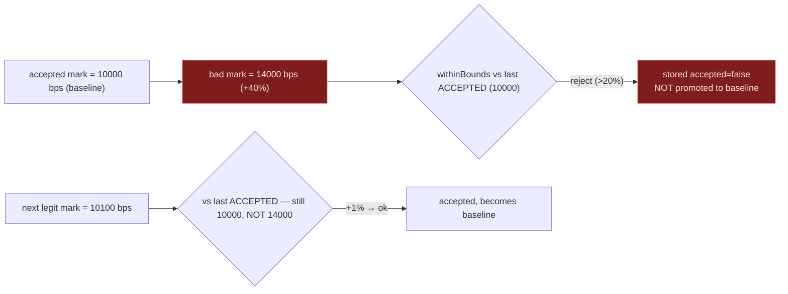

The baseline for the bounds check is always the last **accepted** mark, never the last **received** one. If a rejected +40% spike were allowed to become the baseline, the *next* legitimate mark (back at the true value) would itself look like a -29% crash and get rejected — and now every subsequent good mark cascades into rejection, a single bad input poisoning the feed forever. `lastAccepted` querying `accepted = true` is the one line that prevents this. It's the subtlest correctness point in the NAV path and a great thing to volunteer at a whiteboard.

## 9. Accrual and claim — the money-movement path

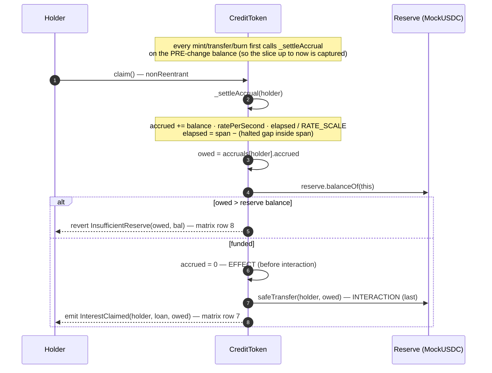

**Lazy accrual, not a cron.** No job loops over holders crediting interest. Instead each holder carries an `Accrual { lastAccruedAt, accrued, haltedSnapshot }`, and interest is computed *on demand* as `balance · ratePerSecond · elapsed / RATE_SCALE`. `claimable(holder)` is a pure view that adds the settled `accrued` to the not-yet-folded slice up to the accrual clock — so the UI ticker reads a live number without any state write. Settlement (folding the slice into `accrued` and stamping the clock) happens only when something forces it: a `claim()`, or a transfer that moves the holder's balance.

**Why settle on the pre-change balance.** `_update` (the OZ hook every mint/transfer/burn funnels through) calls `_settleAccrual` on *both* parties *before* `super._update` moves the tokens. If it settled after, a transfer would retroactively accrue the sender's interest at the receiver's new balance — wrong. Settling first snapshots each party's earnings at the balance they actually held during the elapsed window.

**The halt accounting.** When accrual is frozen (a `NavAnomaly` or a `DEFAULT` status), the contract doesn't eagerly settle every holder. It tracks a global `haltedElapsed` and each holder's `haltedSnapshot`; `elapsed` subtracts the halted gap that fell inside the holder's span. The effect: a halt preserves everyone's pre-halt earnings exactly, with no per-holder write at freeze time — earnings simply stop advancing until the halt clears. `_accrualClock()` returns `accrualEndsAt` (the freeze instant) instead of `now` while halted.

**Reentrancy: belt and suspenders.** `claim()` is `nonReentrant` *and* follows checks-effects-interactions: it zeroes `accrued` (the effect) **before** `safeTransfer` (the interaction). Even if the reserve token had a malicious transfer hook, the holder's claimable is already zero by the time control could re-enter — there's nothing left to double-claim. The forge invariant test asserts total claimed never exceeds total accrued-minus-reserve under adversarial ordering.

## 10. The transfer gauntlet × offering type

The gauntlet's first three steps (frozen sender → frozen receiver → unverified receiver) are universal. Step 4 — eligibility — branches on the token's **offering type**, the dimension that encodes US securities law. Here's where each seeded identity lands, by offering:

| Seeded identity | claims | Reg-D token (accredited-gated) | Reg-S token (non-US-gated) |
|---|---|---|---|
| `ACCREDITED_US_1/2` | verified, accredited, US | ✅ OK | ❌ `NotEligible` (US holder) |
| `REG_S_NONUS_1/2` | verified, non-accredited, non-US | ❌ `AccreditationRequired` | ✅ OK |
| `UNVERIFIED` | not verified | ❌ `ReceiverNotVerified` | ❌ `ReceiverNotVerified` |
| `FROZEN` (as receiver) | verified, frozen | ❌ `ReceiverFrozen` | ❌ `ReceiverFrozen` |
| `FROZEN` (as sender) | verified, frozen | ❌ `SenderFrozen` | ❌ `SenderFrozen` |

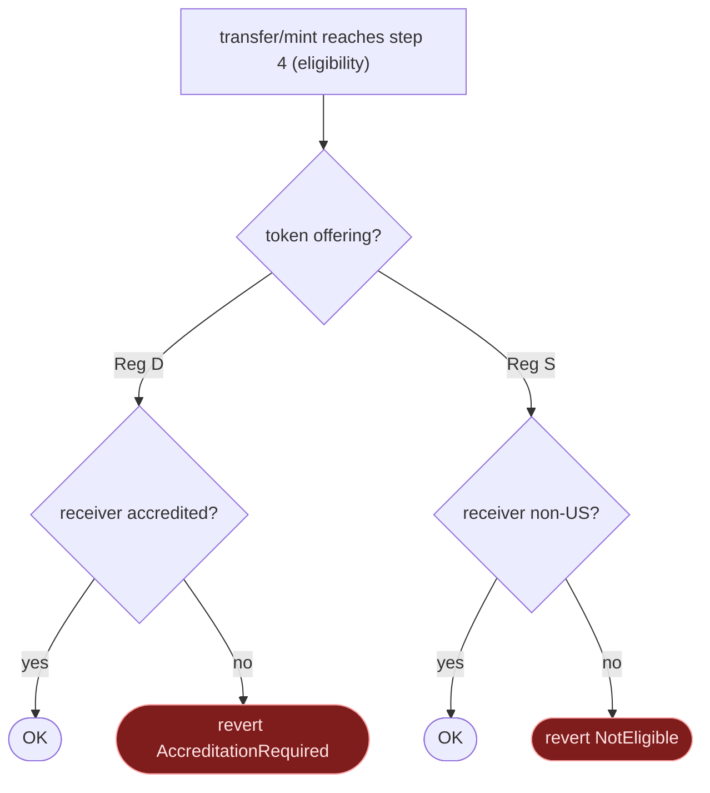

**Why offering type is the right seam.** Reg D and Reg S are the two exemptions under which a real private security actually trades: Reg D restricts to accredited US investors, Reg S to non-US persons. By making `Offering` an immutable property of each `ComplianceRegistry` (and thus each token), the same identity legitimately holds one token and is correctly rejected from another — the compliance logic is *per-offering*, not per-wallet. The grid above is the scenario matrix's rows 1–6: it's not arbitrary test data, it's the cross-product of {identity archetype} × {offering} that a real cap-table must enforce.

**Eligibility is by construction, not by check-after.** The gauntlet runs inside `_update`, the OZ chokepoint every balance change funnels through. There is no code path that moves a token without passing it. `super._update` runs *last*, so a reverting check never mutates balances — the failure is atomic. This is "compliance enforced by construction" made literal.

## 11. Optimistic positions — converging the pending write to truth

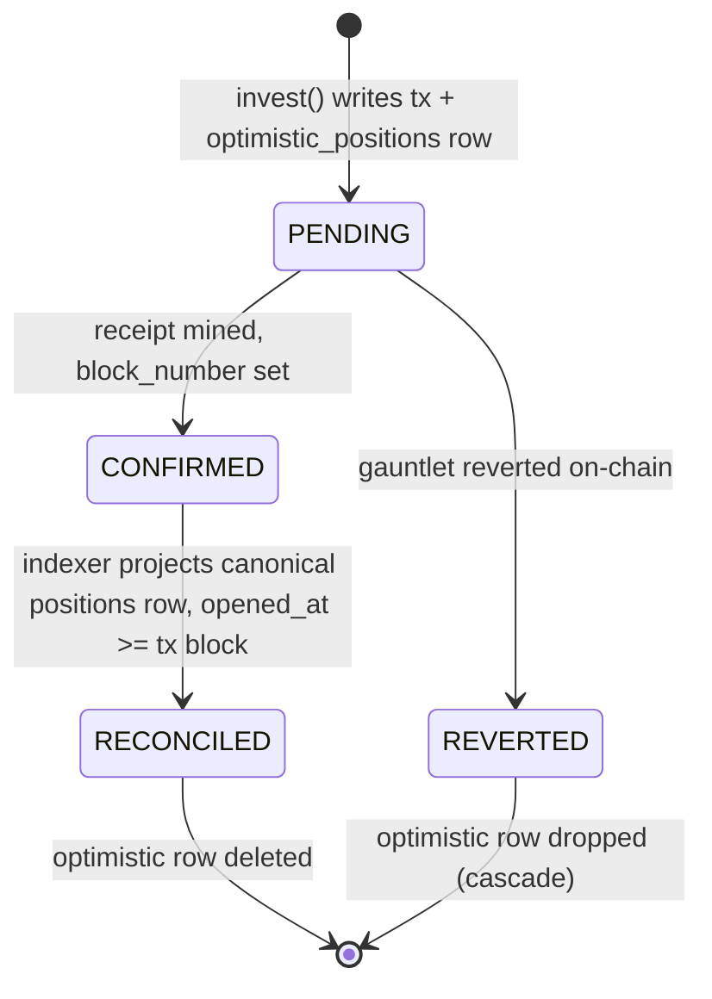

**The problem it solves.** When a holder invests, the tx is `PENDING` for a few seconds before the indexer projects the canonical `positions` row. Without help, the UI would show nothing during that gap — the investment would appear to vanish. So invest writes an `optimistic_positions` row immediately, and the query layer *merges* optimistic rows (marked `optimistic: true`) with canonical ones, so the holder sees their position instantly.

**The convergence rule.** An optimistic row is a projection that *must* converge to on-chain reality — the same convergence requirement the rest of the system enforces. `reconcileOptimistic` deletes an optimistic row once the indexer has projected a canonical `positions` row for the same `(holder, loan)` whose `opened_at` (a block number) is `≥` the tx's settling block. The match is strict on block number, not a bare `(holder, loan)` heuristic — so two rapid invests on one loan reconcile independently rather than one masking the other.

**Failure and idempotency.** If the tx reverts, the optimistic row is dropped (the FK to `tx_status` cascades on delete). And `reconcileOptimistic` is idempotent: a second run deletes zero rows. The optimistic overlay never lies for longer than one indexer lap, and it never leaves orphans — it's a temporary, self-erasing layer over the canonical truth.

## 12. The live feed — Postgres NOTIFY to the browser

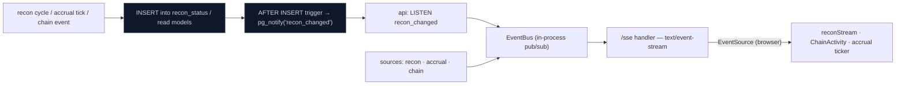

**Why SSE, not polling or Kafka.** The UI needs near-real-time pushes for three streams (recon verdicts, accrual ticks, chain activity) to a handful of browser tabs. SSE is the right-sized tool: it's one-way (server→client, which is all the UI needs), rides plain HTTP (no socket upgrade, no extra infra), and the browser's native `EventSource` auto-reconnects. A message queue like Kafka would be over-built for a single-node demo with one Postgres — it solves durability and fan-out-to-many-consumers problems this system doesn't have. The honest-scope answer at a whiteboard: "SSE because the feed is one-way to a few clients; Kafka would be infrastructure without a problem to solve here, and I'd only reach for it when I needed durable replay or many independent consumers."

**The NOTIFY trick.** The recon driver doesn't push to the UI directly. It writes a `recon_status` row; an `AFTER INSERT` trigger fires `pg_notify('recon_changed')`; the API's `LISTEN` wakes, and the `EventBus` fans the frame out to every connected SSE client. This decouples the writer from the readers entirely — the recon engine doesn't know or care how many UIs are watching, and a UI that connects mid-stream just starts receiving the next frame. Postgres is doing double duty as both the system of record and the message bus, which is exactly the right amount of infrastructure for this scope.

---

### Whiteboard cheat-sheet

If you can draw and narrate these five edges, you own the system:

1. **`_update` → `checkTransfer`** — compliance by construction; nothing moves without the gauntlet.
2. **chain events → indexer → `positions`** — the projection that *might* drift.
3. **recon engine → `claimable()` vs `reserve.balance`** — I2, the solvency gate that catches the drift.
4. **input log → sorted fold → `stateHash`** — determinism that makes the halt auditable.
5. **bad mark → `withinBounds` vs last *accepted*** — the NAV gate and why the baseline is accepted-only.

Everything else is detail hanging off those five.
